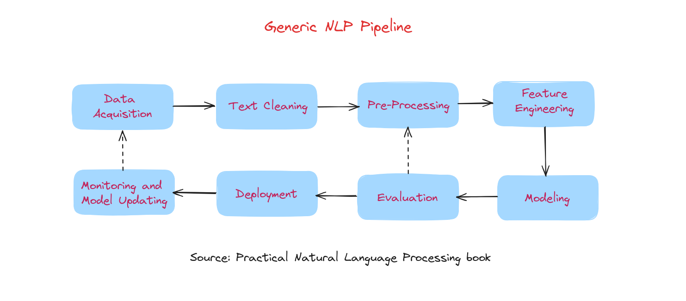
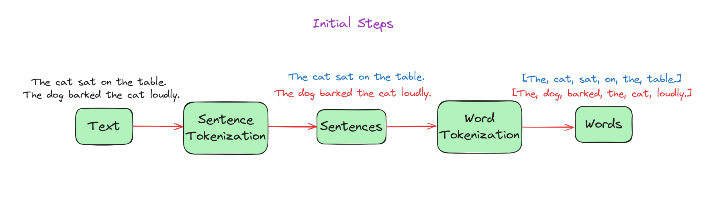
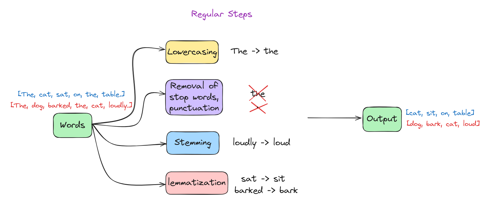
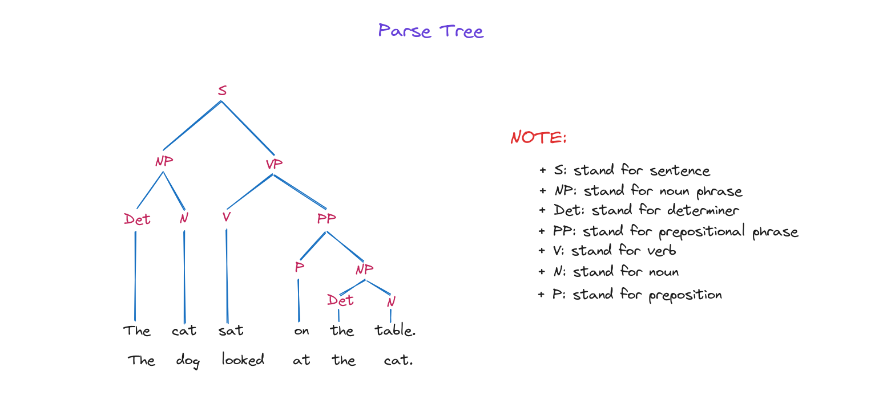

layout: default
title: 3. Quy trình NLP
nav_order: 3
parent: NLP
permalink: /nlp/03_nlp_pipeline/
---

# Quy trình NLP
Chúng ta đã tìm hiểu một số ứng dụng phổ biến của NLP như phân tích cảm xúc, trích xuất thông tin, tóm tắt văn bản,... và bây giờ sẽ khám phá cách xây dựng các ứng dụng này. Để xây dựng một ứng dụng NLP trong tổ chức, chúng ta sẽ chia nhỏ vấn đề thành các bài toán con và phát triển quy trình từng bước, liệt kê tất cả các dạng xử lý văn bản cần thiết. Quy trình này, gọi là pipeline, bao gồm chuỗi các bước cần thiết để xây dựng bất kỳ mô hình NLP nào. Hiểu rõ các bước này là điều quan trọng để giải quyết các vấn đề NLP trong công việc.

Hình trên minh họa các thành phần chính của một quy trình phát triển hệ thống NLP hiện đại dựa trên dữ liệu. Các giai đoạn chính trong pipeline này gồm:

1. Thu thập dữ liệu
2. Làm sạch văn bản
3. Tiền xử lý
4. Kỹ thuật đặc trưng
5. Xây dựng mô hình
6. Đánh giá
7. Triển khai
8. Giám sát và cập nhật mô hình

Phát triển hệ thống NLP bắt đầu bằng việc thu thập dữ liệu liên quan, sau đó làm sạch và tiền xử lý để chuẩn hóa dữ liệu. Tiếp theo, kỹ thuật đặc trưng sẽ trích xuất các chỉ báo hữu ích, được định dạng cho các thuật toán mô hình hóa. Trong giai đoạn xây dựng và đánh giá mô hình, các mô hình khác nhau được xây dựng và kiểm tra. Mô hình tốt nhất sẽ được triển khai, và hiệu suất của nó được giám sát, cập nhật thường xuyên khi cần thiết.

Thực tế, quy trình phát triển NLP không phải lúc nào cũng tuyến tính. Thường phải quay lại các bước như trích xuất đặc trưng, xây dựng mô hình và đánh giá nhiều lần. Có các vòng lặp, đặc biệt từ đánh giá quay lại tiền xử lý, kỹ thuật đặc trưng và xây dựng mô hình. Ở cấp độ dự án, có vòng lặp từ giám sát quay lại thu thập dữ liệu.

Chúng ta sẽ tìm hiểu tổng quan từng giai đoạn của pipeline NLP, bắt đầu với bước đầu tiên: thu thập dữ liệu.

## Thu thập dữ liệu

Dữ liệu là yếu tố quan trọng cho bất kỳ hệ thống học máy nào, và thường là điểm nghẽn trong các dự án công nghiệp. Trong phần này, chúng ta sẽ tìm hiểu các chiến lược thu thập dữ liệu phù hợp cho dự án NLP. Đôi khi dữ liệu có sẵn, nhưng nhiều lúc phải đi tìm kiếm. Dữ liệu văn bản có thể lấy từ các nền tảng như website, email, mạng xã hội, nhưng không phải lúc nào cũng ở dạng máy có thể đọc được hoặc phù hợp với bài toán. Vì vậy, cần hiểu rõ vấn đề trước khi tìm kiếm dữ liệu. Một số phương pháp thu thập dữ liệu gồm:

+ Bộ dữ liệu công khai: Có thể tìm kiếm các bộ dữ liệu công khai để sử dụng, nếu tìm được bộ phù hợp thì có thể xây dựng và đánh giá mô hình. Nếu không có bộ dữ liệu phù hợp, cần cân nhắc các phương án khác.
+ Quét dữ liệu: Có thể lấy dữ liệu liên quan từ Internet. Sau đó, dữ liệu này được quét và gán nhãn bởi người chú thích.
+ Tăng cường dữ liệu: Việc thu thập dữ liệu hiệu quả nhưng tốn thời gian. Vì vậy, có thể sử dụng kỹ thuật tăng cường dữ liệu để tạo ra văn bản có cấu trúc tương tự dữ liệu nguồn cho các bài toán NLP.

## Làm sạch văn bản
Đôi khi dữ liệu thu được không sạch, chứa các thẻ HTML, lỗi chính tả hoặc ký tự đặc biệt. Vì vậy, cần có các phương pháp để làm sạch dữ liệu văn bản.

+ Chuẩn hóa Unicode: Khi làm việc với dữ liệu văn bản, có thể gặp các ký hiệu, emoji hoặc ký tự đặc biệt. Có thể chuyển chúng thành dạng văn bản mà máy tính hiểu được.
+ Phân tích và làm sạch HTML: Phân tích mã HTML để hiểu cấu trúc, sau đó loại bỏ các thành phần không cần thiết hoặc sai (như thẻ HTML) để đảm bảo mã sạch và đúng định dạng.
+ Kiểm tra chính tả: Thực hiện kiểm tra chính tả cơ bản để sửa lỗi thường gặp và làm cho văn bản nhất quán.

Chúng ta cùng chuyển sang bước tiếp theo trong pipeline: tiền xử lý.

## Tiền xử lý

Ngay cả sau khi làm sạch văn bản, vẫn cần tiền xử lý, đặc biệt khi thu thập dữ liệu từ Internet. Ngoài ra, phần mềm NLP yêu cầu văn bản phải được tách thành câu và từ. Tiền xử lý bao gồm các nhiệm vụ này, cũng như loại bỏ ký tự đặc biệt, số, chuyển văn bản về chữ thường nếu cần. Các quyết định này được thực hiện trong giai đoạn tiền xử lý NLP.

+ Bước khởi đầu:
    + Phân đoạn câu: Là quá trình chia văn bản thành các câu riêng biệt.
    + Tách từ: Là quá trình tách các câu (đầu ra từ bước phân đoạn câu) thành các từ riêng biệt.

+ Bước thường gặp:
    + Loại bỏ stop word: Là quá trình loại bỏ các từ phổ biến, không cần thiết khỏi văn bản.
    + Loại bỏ số/ký tự đặc biệt: Là quá trình xóa các số và dấu câu khỏi văn bản.
    + Chuyển về chữ thường: Là quá trình chuyển tất cả ký tự trong văn bản thành chữ thường.
    + Stemming và lemmatization: Là quá trình đưa từ về dạng gốc hoặc cơ sở.

+ Bước khác:
    + Gán nhãn từ loại (POS tagging): Là quá trình gán nhãn các từ trong văn bản với loại từ như danh từ, động từ, tính từ.

    + Giải quyết đồng tham chiếu: Là quá trình xác định khi các từ khác nhau cùng chỉ về một thực thể trong văn bản.

    + Cây phân tích cú pháp: Biểu diễn cấu trúc cú pháp của một chuỗi theo ngữ pháp, các node là các thành phần và node gốc là ký hiệu bắt đầu.

Tiếp theo, chúng ta sẽ chuyển sang bước kỹ thuật đặc trưng.

## Kỹ thuật đặc trưng
Chúng ta đã thảo luận các bước tiền xử lý và sự hữu ích của chúng. Để sử dụng văn bản đã tiền xử lý trong các mô hình học máy (ML), cần kỹ thuật đặc trưng, chuyển văn bản thành các vector số mà thuật toán ML có thể hiểu. Quá trình này gọi là "biểu diễn văn bản".

Có hai cách tiếp cận chính cho kỹ thuật đặc trưng:

+ Kỹ thuật đặc trưng cho pipeline ML truyền thống: Thường được thiết kế thủ công cho từng bài toán cụ thể. Ví dụ, trong phân tích cảm xúc đánh giá sản phẩm, có thể đếm số từ tích cực và tiêu cực để dự đoán cảm xúc. Đặc trưng được thiết kế theo bài toán và kiến thức miền, đặc trưng thủ công giúp mô hình dễ giải thích bằng cách cho thấy từng đặc trưng ảnh hưởng thế nào đến dự đoán.

+ Kỹ thuật đặc trưng cho pipeline học sâu: Sử dụng dữ liệu thô đã tiền xử lý và học đặc trưng từ đó, thường cho hiệu suất tốt hơn. Tuy nhiên, mô hình học sâu mất khả năng giải thích vì khó giải thích dự đoán của chúng. Ví dụ, trong phát hiện email rác, dễ xác định từ nào ảnh hưởng đến quyết định với đặc trưng thủ công, nhưng khó với mô hình học sâu.

Có nhiều kỹ thuật đặc trưng có thể kể đến như:

+ Bag of Words (BoW): Là phương pháp biểu diễn văn bản bằng cách chuyển văn bản thành tập hợp các từ, bỏ qua ngữ pháp và thứ tự, đếm tần suất xuất hiện của từng từ.

+ TF-IDF (Term Frequency-Inverse Document Frequency): Là phương pháp biểu diễn văn bản đánh giá mức độ quan trọng của một từ trong tài liệu dựa trên tần suất xuất hiện trong tài liệu và độ hiếm trên toàn bộ tập tài liệu.

+ One-Hot Encoding: Là phương pháp chuyển dữ liệu phân loại thành vector nhị phân, mỗi loại được biểu diễn bằng một vector duy nhất có một vị trí là '1', các vị trí còn lại là '0'.

+ Word Embedding (Word2Vec, GloVe, FastText): Là kỹ thuật biểu diễn từ dưới dạng vector đặc, liên tục trong không gian, nắm bắt quan hệ ngữ nghĩa giữa các từ dựa trên cách sử dụng trong tập văn bản lớn.

Tất cả các kỹ thuật này sẽ được trình bày chi tiết hơn trong bài học **Word Embeddings**.

Bây giờ, chúng ta cùng tìm hiểu bước tiếp theo trong pipeline, gọi là xây dựng mô hình.

## Xây dựng mô hình

Khi đã có dữ liệu dự án NLP và nắm được các bước làm sạch, tiền xử lý cần thiết, trọng tâm chuyển sang xây dựng giải pháp hiệu quả. Ban đầu, các phương pháp đơn giản và quy tắc là đủ, đặc biệt khi dữ liệu còn ít. Khi hiểu rõ vấn đề hơn và có nhiều dữ liệu, có thể tăng dần độ phức tạp để cải thiện hiệu suất.

Khi bắt đầu dự án với dữ liệu hạn chế, có thể dùng phương pháp heuristic, đặc biệt cho các nhiệm vụ thu thập dữ liệu cho mô hình ML/DL. Phương pháp này thường dựa vào biểu thức chính quy để thu thập và xử lý dữ liệu hiệu quả.

Sau đó, có thể sử dụng các mô hình học máy như Naive Bayes, SVM, Hidden Markov Model, Conditional Random Fields để giải quyết bài toán.

Cuối cùng, việc sử dụng mạng nơ-ron ngày càng phổ biến để xử lý dữ liệu phức tạp, không có cấu trúc như ngôn ngữ. Để xử lý hiệu quả, cần các mô hình có khả năng biểu diễn và học tốt hơn. Một số mạng nơ-ron sâu có thể kể đến như: RNN, LSTM, GRU và mới nhất là Attention, Transformer, Bert...

## Đánh giá
Một bước quan trọng trong pipeline NLP là đánh giá hiệu quả của mô hình, thường được đo bằng hiệu suất trên dữ liệu chưa từng thấy. Các chỉ số đánh giá thay đổi tùy theo nhiệm vụ NLP và giai đoạn dự án. Trong quá trình xây dựng và triển khai mô hình, dùng các chỉ số ML, còn khi vận hành thực tế, dùng thêm các chỉ số kinh doanh để đo lường tác động.

Có hai loại đánh giá:
+ Đánh giá nội tại: So sánh đầu ra mô hình với bộ kiểm thử có nhãn để đo mức độ khớp, ví dụ:
    + RMSE: Đo độ lớn trung bình của sai số dự đoán, dùng cho bài toán hồi quy như dự đoán nhiệt độ, giá cổ phiếu...
    + MAPE: Đo phần trăm sai số trung bình giữa giá trị dự đoán và thực tế, thể hiện độ chính xác của mô hình dự báo.
    + Accuracy: Đo tỷ lệ dự đoán đúng trên tổng số dự đoán, dùng cho phân loại như phân tích cảm xúc, phát hiện email rác...
    + Precision: Đo tỷ lệ dự đoán dương đúng trên tổng số dự đoán dương, dùng cho phân loại.
    + Recall: Đo tỷ lệ dự đoán dương đúng trên tổng số trường hợp dương thực tế, dùng cho phân loại.
    + F1 score: Kết hợp precision và recall thành một chỉ số duy nhất, là trung bình điều hòa của cả hai, dùng cho phân loại.
    + AUC: Đo hiệu suất của mô hình phân loại nhị phân, thể hiện khả năng phân biệt giữa các lớp, thường dùng với đường cong ROC.
    + BLEU: Đánh giá chất lượng văn bản dịch máy bằng cách so sánh với bản dịch tham chiếu, đo mức độ trùng lặp từ giữa bản dịch và tham chiếu.
    + ROUGE: Đánh giá tóm tắt văn bản bằng cách so sánh với bản tóm tắt tham chiếu, tập trung vào mức độ trùng lặp n-gram, chuỗi từ và cặp từ.

+ Đánh giá ngoại tại: Đo mục tiêu cuối cùng, ví dụ như thời gian người dùng phải xử lý email rác.

## Triển khai

Trong thực tế, hệ thống NLP thường được tích hợp vào các hệ thống lớn hơn, ví dụ như bộ lọc email rác. Sau khi hoàn thành các bước xử lý, xây dựng mô hình và đánh giá, việc triển khai giải pháp cuối cùng là rất quan trọng. Điều này bao gồm tích hợp module NLP vào hệ thống lớn hơn, đảm bảo khả năng mở rộng và tương thích với pipeline đầu vào/đầu ra trong môi trường sản xuất.

Module NLP thường được triển khai dưới dạng dịch vụ web, nhận đầu vào là văn bản và trả về đầu ra phân loại, ví dụ như email rác hoặc không rác. Dịch vụ này xử lý email theo thời gian thực, hỗ trợ quyết định xử lý email. Với các tác vụ xử lý hàng loạt, module NLP có thể được tích hợp vào các hàng đợi tác vụ lớn hơn, như trên Google Cloud hoặc AWS.

## Giám sát và cập nhật mô hình
### Giám sát
Tương tự các dự án phần mềm khác, kiểm thử kỹ lưỡng là cần thiết trước khi triển khai bất kỳ mô hình NLP nào, và giám sát liên tục là rất quan trọng sau khi triển khai. Tuy nhiên, giám sát dự án NLP cần chú ý đặc biệt để đảm bảo đầu ra của mô hình luôn có ý nghĩa theo thời gian. Điều này bao gồm kiểm tra thường xuyên hành vi mô hình, nhất là khi mô hình được cập nhật huấn luyện thường xuyên. Sử dụng dashboard hiệu suất hiển thị các tham số mô hình và chỉ số chính sẽ hỗ trợ việc này.

### Cập nhật mô hình
Khi mô hình đã triển khai và bắt đầu thu thập dữ liệu mới, chúng ta sẽ lặp lại mô hình dựa trên dữ liệu mới này để dự đoán luôn phù hợp.

## Kết luận

Trong bài học này, chúng ta đã tìm hiểu quy trình xử lý ngôn ngữ tự nhiên (NLP), từ thu thập dữ liệu đến giám sát và cập nhật mô hình. Hiểu rõ quy trình này là điều quan trọng để xây dựng các ứng dụng NLP hiệu quả.

## Tài liệu tham khảo

+ Sowmya Vajjala, Bodhisattwa Majumder, Anuj Gupta, và Harshit Surana, Practical natural language processing: a comprehensive guide to building real-world NLP systems. Sebastopol, Ca O’reilly Media, 2020.
+ “Natural Language Processing (NLP) Pipeline,” GeeksforGeeks, 01/06/2023. https://www.geeksforgeeks.org/natural-language-processing-nlp-pipeline/
+ “Behind the pipeline - Hugging Face NLP Course,” huggingface.co. https://huggingface.co/learn/nlp-course/en/chapter2/2 (truy cập ngày 07/07/2024).