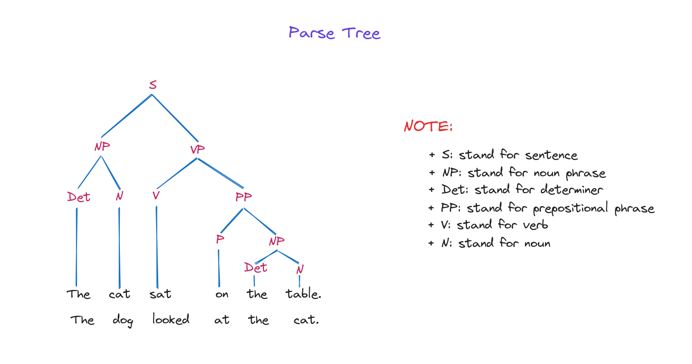

# Constituency Parsing (Phân tích thành phần) và Dependency Parsing (Phân tích phụ thuộc)

## Giới thiệu (Introduction)

Trong ngôn ngữ học tính toán (computational linguistics), parsing (phân tích cú pháp) là quá trình tạo ra một cây phân tích cú pháp (parse tree) thể hiện cấu trúc ngữ pháp của một câu. Cây phân tích này minh họa mối quan hệ giữa các từ và cụm từ dựa trên ngữ pháp hình thức.

Hai phương pháp parsing chính là constituency parsing (phân tích thành phần) và dependency parsing (phân tích phụ thuộc), mỗi phương pháp tạo ra một loại cây khác nhau do giả định ngữ pháp khác nhau. Cả hai đều nhằm mục đích trích xuất thông tin cú pháp.

## Constituency Parsing (Phân tích thành phần)

Cây phân tích thành phần (constituency parse tree), dựa trên ngữ pháp phi ngữ cảnh (context-free grammars), chia một câu thành các cụm con (constituents) thuộc các loại ngữ pháp cụ thể.

Trong tiếng Anh, các cụm như "a cat", "a cat on the table", "the nice cat" là cụm danh từ (noun phrase - NP), còn "play football", "go to school" là cụm động từ (verb phrase - VP).

Ngữ pháp quy định cách tạo câu hợp lệ bằng một tập các luật. Ví dụ, luật VP → V NP nghĩa là một cụm động từ (VP) có thể tạo thành từ một động từ (V) kết hợp với một cụm danh từ (NP).

Các luật này vừa dùng để sinh câu hợp lệ, vừa để phân tích cấu trúc cú pháp của câu theo ngữ pháp.

Ví dụ về cây phân tích thành phần:

Cây phân tích thành phần luôn có các từ của câu là nút lá (terminal nodes). Mỗi từ thường có một nút cha thể hiện nhãn từ loại (part-of-speech tag) như danh từ, động từ, tính từ... (có thể bị lược bỏ trong một số biểu diễn).

Các nút không lá (non-terminal nodes) đại diện cho các thành phần của câu, thường gồm cụm động từ (VP), cụm danh từ (NP), cụm giới từ (PP).

Trong ví dụ này, ngay dưới gốc cây, câu được chia thành một cụm danh từ "The cat" và một cụm động từ "sat on the table". Điều này nghĩa là ngữ pháp có luật S → NP VP, tức là một câu có thể tạo thành từ một cụm danh từ và một cụm động từ. Tương tự, các cụm này lại được chia nhỏ hơn, tương ứng với các luật khác trong ngữ pháp.

Tóm lại, constituency parsing sử dụng ngữ pháp phi ngữ cảnh để tạo ra cây phân cấp thể hiện cú pháp của câu, chia nhỏ thành các thành phần cụm.

### Ứng dụng của Constituency Parsing
Constituency parsing giúp xác định các thành phần của câu (cụm danh từ, động từ, mệnh đề...) và nhóm chúng thành cấu trúc cây thể hiện quan hệ ngữ pháp.

Một số ứng dụng của constituency parsing:

1. Xử lý ngôn ngữ tự nhiên (NLP): Dùng trong các tác vụ như tóm tắt văn bản, dịch máy, trả lời câu hỏi, phân loại văn bản.
2. Truy xuất thông tin (Information Retrieval): Trích xuất thông tin từ văn bản lớn và lập chỉ mục để truy xuất hiệu quả.
3. Chuyển văn bản thành giọng nói (Text-to-Speech): Hỗ trợ tạo giọng nói tự nhiên nhờ hiểu ngữ pháp và cấu trúc câu.
4. Phân tích cảm xúc (Sentiment Analysis): Giúp xác định cảm xúc tích cực, tiêu cực hay trung tính bằng cách phân tích các thành phần của câu.

## Dependency Parsing (Phân tích phụ thuộc)

Khác với constituency parsing, dependency parsing không sử dụng các cụm từ (phrasal constituents) mà thể hiện cấu trúc câu thông qua các quan hệ phụ thuộc (dependencies) giữa các từ, được biểu diễn bằng các cạnh có hướng và nhãn trong đồ thị.

Cây phân tích phụ thuộc (dependency parse tree) là một đồ thị G = (V, E) với V là các từ trong câu, E là các cạnh nối các cặp từ. Đồ thị này phải thỏa mãn 3 điều kiện:

+ Có một nút gốc (root) không có cạnh vào.
+ Với mỗi nút v trong V, phải có đường đi từ gốc R đến v.
+ Mỗi nút (trừ gốc) chỉ có đúng 1 cạnh vào.

Mỗi cạnh trong E có một loại (type) xác định quan hệ ngữ pháp giữa hai từ được nối.

Ví dụ về cây phân tích phụ thuộc:

Kết quả rất khác biệt vì phương pháp này dùng động từ làm gốc cây, các cạnh thể hiện quan hệ giữa các từ.

Ví dụ, từ “sat” có cạnh ra loại subj tới từ “cat”, nghĩa là “cat” là chủ ngữ của động từ “sat”. Khi đó, ta nói “cat” phụ thuộc vào “sat”.

### Ứng dụng của Dependency Parsing
Dependency parsing phân tích cấu trúc câu bằng cách xác định các quan hệ phụ thuộc giữa các từ và biểu diễn chúng dưới dạng đồ thị có hướng.

Một số ứng dụng của dependency parsing:
1. Nhận diện thực thể (Named Entity Recognition - NER): Giúp xác định và phân loại các thực thể như người, địa điểm, tổ chức trong văn bản.
2. Gán nhãn từ loại (Part-of-Speech - POS Tagging): Xác định và phân loại từ loại của từng từ trong câu như danh từ, động từ, tính từ...
3. Dịch máy (Machine Translation): Hỗ trợ dịch câu bằng cách phân tích quan hệ phụ thuộc và sinh ra các quan hệ tương ứng ở ngôn ngữ đích.
4. Sinh văn bản (Text Generation): Sinh văn bản mới dựa trên phân tích quan hệ phụ thuộc và tạo ra các từ phù hợp với cấu trúc.

## So sánh Constituency Parsing và Dependency Parsing

| Đặc điểm (Characteristic) | Constituency Parsing (Phân tích thành phần) | Dependency Parsing (Phân tích phụ thuộc) |
| --- | --- | --- |
| `Cấu trúc cây (Tree Structure)` | Tạo cây phân cấp các cụm lồng nhau. | Tạo cây phẳng hơn, mỗi từ trỏ tới từ "gốc" của nó, tập trung vào quan hệ từ-từ. |
| `Trọng tâm (Focus)` | Tập trung vào cấu trúc cụm và phân cấp. | Tập trung vào quan hệ giữa các từ và chức năng ngữ pháp. |
| `Độ phức tạp (Complexity)` | Có thể phức tạp hơn do cấu trúc lồng nhau. | Thường đơn giản và trực quan hơn khi biểu diễn quan hệ trực tiếp giữa các từ. |

## Kết luận (Conclusion)

Trong bài học này, chúng ta đã tìm hiểu về Constituency Parsing (phân tích thành phần) và Dependency Parsing (phân tích phụ thuộc)—hai kỹ thuật quan trọng để phân tích cấu trúc cú pháp của câu. Constituency Parsing chia nhỏ câu thành các cụm, thể hiện cấu trúc phân cấp, còn Dependency Parsing tập trung vào quan hệ giữa từng từ.

Hiểu rõ các phương pháp này giúp chúng ta phân tích sâu hơn về cấu trúc và ý nghĩa của câu.

## Tài liệu tham khảo (References)

+ “Constituency Parsing and Dependency Parsing,” GeeksforGeeks, Jan. 26, 2023. https://www.geeksforgeeks.org/constituency-parsing-and-dependency-parsing/
+ F. Elia, “Constituency vs Dependency Parsing | Baeldung on Computer Science,” www.baeldung.com, Jun. 17, 2020. https://www.baeldung.com/cs/constituency-vs-dependency-parsing
+ ZenTM️S., “Syntactic Parsing practices in NLP: Constituency and Dependency Parsing,” Plain Simple Software, Oct. 10, 2022. https://medium.com/plain-simple-software/syntactic-parsing-practices-in-nlp-constituency-and-dependency-parsing-43f79244b2af
