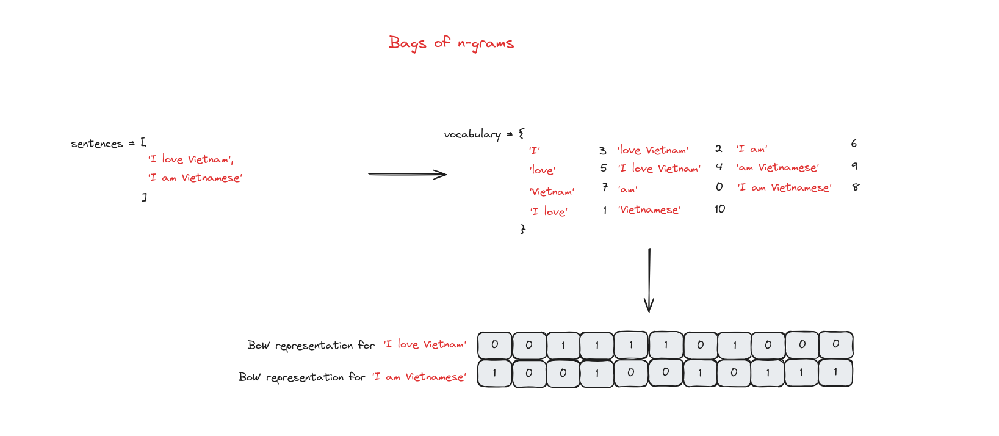
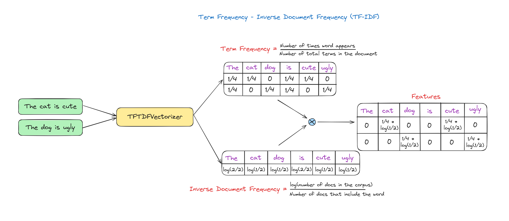
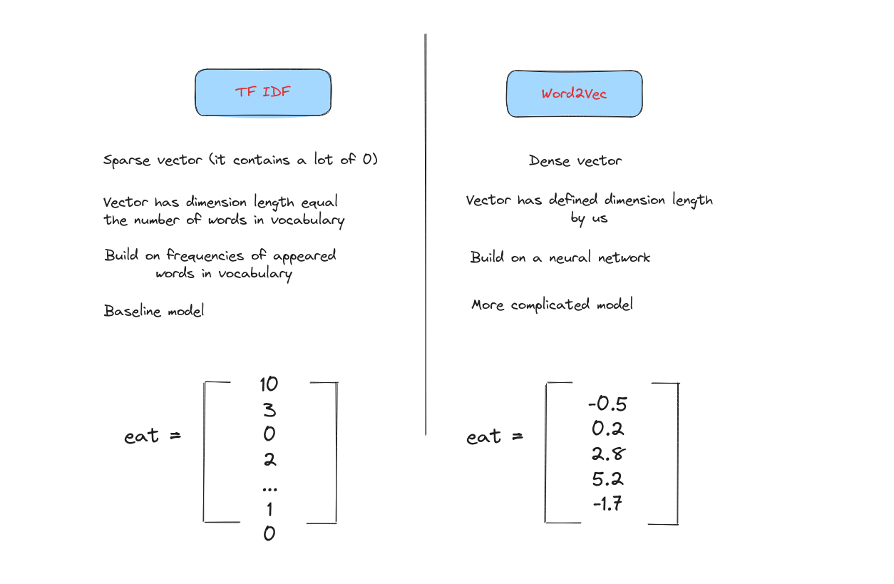
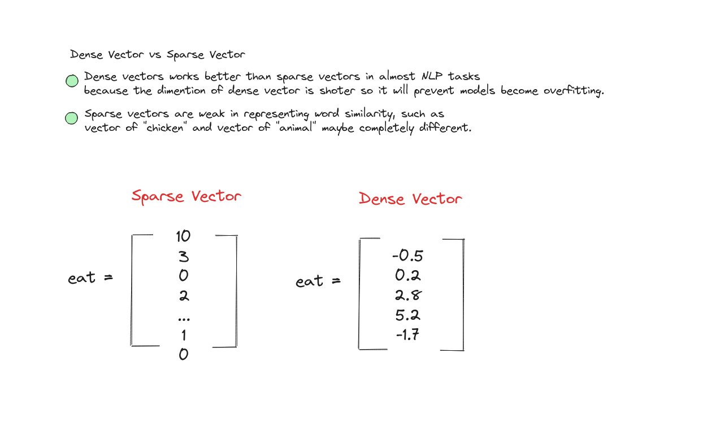

# Word Embedding (Biểu diễn từ)


## Giới thiệu (Introduction)

Word Embedding là một kỹ thuật mạnh mẽ trong NLP (Xử lý ngôn ngữ tự nhiên) để biểu diễn các từ trong không gian vector liên tục. Khác với các cách biểu diễn truyền thống, word embedding giúp mô hình nắm bắt được mối quan hệ ngữ nghĩa (semantic relationships) giữa các từ, cho phép hiểu được ngữ cảnh và ý nghĩa. Trong bài này, chúng ta sẽ tìm hiểu các phương pháp phổ biến như Word2Vec và GloVe, cách huấn luyện embedding, cũng như ứng dụng của chúng trong các bài toán NLP.

Kết thúc bài học, bạn sẽ có thể sử dụng word embedding để nâng cao phân tích văn bản và các mô hình machine learning.


## Xử lý ngôn ngữ tự nhiên (Natural Language Processing)
NLP (Natural Language Processing - Xử lý ngôn ngữ tự nhiên) là một nhánh của Trí tuệ nhân tạo (Artificial Intelligence - AI). Nó giúp máy tính có khả năng đọc, hiểu và suy luận ngôn ngữ của con người.


## Sự phát triển của NLP (NLP development)
Ngày nay, NLP đã đạt được nhiều cột mốc đáng nhớ. Đầu tiên là sự xuất hiện của Word2Vec, cho phép biểu diễn một câu hoặc từ bằng một con số xác định. Để cải thiện biểu diễn này, attention mechanism (cơ chế chú ý) ra đời, là tiền đề cho mô hình transformer—bước đột phá trong nghiên cứu AI và là nền tảng cho nhiều mô hình nổi bật như GPT-4, Gemini, LLama2.


Tuy nhiên, tất cả các mô hình này sẽ không hoạt động hiệu quả nếu không có một cách biểu diễn ngôn ngữ mạnh mẽ gọi là **Word Embedding**. Hãy cùng tìm hiểu những thách thức khi xây dựng Word Embedding trong những ngày đầu và cách các nhà nghiên cứu NLP giải quyết chúng.


## Thách thức của Word Embedding (Word Embedding challenges)

Ba khó khăn chính khi xây dựng hệ thống word embedding là:
- Đa nghĩa (Ambiguous).
- Thành ngữ (Idioms).
- Ý nghĩa phụ thuộc vào ngữ cảnh (Meaning depends on context).


Ví dụ, với câu "The old man the boats", ta không thể biết nghĩa thực sự nếu không dựa vào các câu xung quanh, nên embedding phải khác nhau tùy trường hợp. Thành ngữ cũng là trường hợp khó biểu diễn.
 

## Tokenizer (Bộ tách từ)
Tokenizer là quá trình chia câu, cụm từ, đoạn văn hoặc toàn bộ tài liệu thành các đơn vị nhỏ hơn, có thể là từ hoặc ký tự. Mỗi đơn vị này gọi là một token (token - đơn vị).


Gần đây, có nhiều kỹ thuật tokenizer tiên tiến được sử dụng trong các mô hình SOTA (state-of-the-art - hiện đại nhất) như Byte-Pair Encoding, WordPiece, SentencePiece.


## Ngữ nghĩa từ vựng (Lexical Semantics)

Lexical semantics là một nhánh của ngôn ngữ học nghiên cứu về ý nghĩa và mối quan hệ giữa các từ. Nó xem xét cách các từ được cấu trúc, diễn giải và liên kết với nhau trong một ngôn ngữ.


Ví dụ về **Word Similarity** (độ tương đồng từ vựng): hai từ "dog" và "cat" không phải là từ đồng nghĩa, nhưng chúng khá gần nhau về mặt ý nghĩa. Cách ta nói "dog is very lovely" và "cat is very lovely" rất giống nhau. Việc xem xét ngữ nghĩa từ vựng trên cặp từ giúp xây dựng Word Embedding sau này.


## Semantic vector (Vector ngữ nghĩa)
Semantic vector là cách biểu diễn một từ trong không gian ngữ nghĩa nhiều chiều, được xây dựng dựa trên mối quan hệ giữa từ đó và các từ xung quanh.

Hai từ gần nhau trong không gian ngữ nghĩa sẽ có ý nghĩa tương tự nhau.


**Lưu ý:** Để thử nghiệm với semantic vector, bạn có thể truy cập [Tensorflow Projector](https://projector.tensorflow.org/).


## Embedding (Biểu diễn nhúng)
Embedding là tập hợp các semantic vector (vector ngữ nghĩa). Từ "semantic" ở đây nhấn mạnh rằng các vector này không phải ngẫu nhiên mà được thiết kế để nắm bắt và biểu diễn ý nghĩa, mối quan hệ giữa các từ trong ngôn ngữ, giúp các tác vụ NLP hiệu quả và tinh tế hơn.


## Các loại Embedding (Embedding Types)


### One Hot Vector
One Hot Encoding (Mã hóa one-hot) biến mỗi token thành một vector nhị phân. Đầu tiên, mỗi token được gán một giá trị số nguyên. Sau đó, số nguyên này được biểu diễn thành vector nhị phân, tất cả các giá trị là 0 trừ vị trí của số nguyên đó là 1.


### Bag of Words (BoW)
Bag of Words (Túi từ) chỉ ghi nhận từ nào xuất hiện trong tài liệu và tần suất xuất hiện, không quan tâm đến ngữ pháp hay thứ tự từ.


### Bag of n-grams
Trong Bag of Words, cụm từ và thứ tự từ không được xét đến. Bag of n-grams khắc phục điều này bằng cách chia văn bản thành các nhóm gồm n từ liên tiếp.




### TF-IDF (Term Frequency – Inverse Document Frequency)
Ở các phương pháp trên, mọi từ đều có trọng số như nhau. Tuy nhiên, TF-IDF đánh giá tầm quan trọng của một từ trong toàn bộ tập dữ liệu (corpus).


+ Term Frequency (TF): Đo tần suất xuất hiện của một từ trong tài liệu, tính bằng tỉ lệ số lần xuất hiện của từ đó trên tổng số từ trong tài liệu.

+ Inverse Document Frequency (IDF): Đo tầm quan trọng của từ trên toàn bộ tập dữ liệu, giảm trọng số cho từ phổ biến và tăng trọng số cho từ hiếm.

+ TF-IDF Score: Là tích của TF và IDF.


Hình dưới minh họa cách tính TF-IDF.




Ví dụ dưới đây là cách triển khai TF-IDF trong Python.

```shell
import nltk 
nltk.download('punkt') # Download 'punkt' 
# from nltk if it's not downloaded 
from sklearn.feature_extraction.text import TfidfVectorizer 

sentences = ["I love Vietnam", "Vietnamese people are pretty friendly",\
             "I love cooking", "I am Vietnamese"]  

# TF-IDF 
tfidf = TfidfVectorizer() 
tfidf_matrix = tfidf.fit_transform(sentences) 
  
# All words in the vocabulary. 
print("vocabulary", tfidf.get_feature_names_out()) 
# IDF value for all words in the vocabulary 
print("IDF for all words in the vocabulary :\n", tfidf.idf_) 
  
# TFIDF representation for all documents in our corpus 
print('\nTFIDF representation for "{}" is \n{}'
      .format(sentences[0], tfidf_matrix[0].toarray())) 
print('TFIDF representation for "{}" is \n{}'
      .format(sentences[1], tfidf_matrix[1].toarray())) 
print('TFIDF representation for "{}" is \n{}'
      .format(sentences[2],tfidf_matrix[2].toarray())) 
  
# TFIDF representation for a new text 
matrix = tfidf.transform(["learning dsa from geeksforgeeks"]) 
print("\nTFIDF representation for  'learning dsa from geeksforgeeks' is\n", 
      matrix.toarray())
```

Kết quả:
```shell
vocabulary ['am' 'are' 'cooking' 'friendly' 'love' 'people' 'pretty' 'vietnam'
 'vietnamese']
IDF for all words in the vocabulary :
 [1.91629073 1.91629073 1.91629073 1.91629073 1.51082562 1.91629073
 1.91629073 1.91629073 1.51082562]

TFIDF representation for "I love Vietnam" is 
[[0.         0.         0.         0.         0.6191303  0.
  0.         0.78528828 0.        ]]
TFIDF representation for "Vietnamese people are pretty friendly" is 
[[0.         0.46516193 0.         0.46516193 0.         0.46516193
  0.46516193 0.         0.36673901]]
TFIDF representation for "I love cooking" is 
[[0.         0.         0.78528828 0.         0.6191303  0.
  0.         0.         0.        ]]

TFIDF representation for  'I love vietnamese people' is
 [[0.         0.         0.         0.         0.52640543 0.66767854
  0.         0.         0.52640543]]
```




Trong phạm vi bài này, chúng ta sẽ tập trung vào **Word2Vec**, một kỹ thuật **Word Embedding** được sử dụng rộng rãi trong các mô hình hiện đại.


## Word Embeddings (Biểu diễn từ nhúng)
Word embedding là cách biểu diễn các từ dưới dạng vector dày đặc (dense vector) trong không gian liên tục, trong đó độ tương đồng giữa các từ được thể hiện qua khoảng cách giữa các vector. Thông thường, ta dùng [cosine similarity](https://en.wikipedia.org/wiki/Cosine_similarity) để đo độ gần nhau về hướng giữa hai vector.

Word embedding thường được dùng để biểu diễn từ trước khi đưa vào các mô hình NLP.

Các vector này ngắn và dày đặc.




## Word2Vec
Word2Vec là một loại embedding tĩnh (static embedding), mỗi từ chỉ được biểu diễn bằng một vector cố định.

Điểm yếu của Word2Vec là không thể biểu diễn ngữ cảnh động, nên các kỹ thuật mới như **ELMO**, **BERT** và gần đây nhất là **Attention** ra đời để tạo embedding động (dynamic contextual embedding)—một từ có thể có nhiều vector khác nhau tùy ngữ cảnh. Phần này sẽ được nói kỹ hơn ở bài sau.


## Cơ chế hoạt động của Word2Vec (Word2Vec mechanism)


Mỗi từ đưa vào Word2Vec sẽ được chuyển thành một vector embedding để sử dụng cho các mô hình NLP.

Có hai cách xây dựng Word2Vec: **Continuous Bag Of Words (CBOW)** và **Skip Gram**.

## Continuous Bag Of Words (CBOW)
CBOW là một loại mô hình word embedding trong NLP, dự đoán từ trung tâm dựa trên ngữ cảnh các từ xung quanh trong một cửa sổ cố định.
### Cách hoạt động của CBOW (How CBOW works)


Các word embedding sinh ra từ CBOW có thể dùng cho nhiều tác vụ NLP như phân tích cảm xúc, mô hình ngôn ngữ, dịch máy...

## Skip Gram
Skip-gram là một loại mô hình word embedding khác trong NLP. Khác với CBOW, Skip-gram dự đoán các từ ngữ cảnh dựa trên từ trung tâm.

### Cách hoạt động của Skip Gram (How Skip Gram works)


Skip Gram phù hợp khi muốn nắm bắt các mối quan hệ ngữ nghĩa tinh vi giữa các từ, hoặc quan tâm đến các từ hiếm và có tập dữ liệu lớn để huấn luyện. Nếu dữ liệu nhỏ hoặc muốn nắm ý nghĩa tổng thể, CBOW là lựa chọn tốt. Tương tự CBOW, Skip Gram cũng dùng cho các tác vụ như phân tích cảm xúc, mô hình ngôn ngữ, dịch máy...


## Triển khai CBOW Word2Vec (Implement CBOW Word2Vec)
Bây giờ, chúng ta sẽ xây dựng CBOW Word2Vec để embedding các từ.

### Import các thư viện cần thiết (Import necessary libraries)
```shell
import numpy as np
import tensorflow as tf
from tensorflow.keras.utils import to_categorical
from tensorflow.keras.preprocessing.text import Tokenizer
from tensorflow.keras.preprocessing.sequence import pad_sequences
from tensorflow.keras.preprocessing.text import text_to_word_sequence
from tensorflow.keras.models import Sequential
from tensorflow.keras.layers import Dense, Embedding, Lambda
from tensorflow.keras.backend import mean
```

### Tạo tập dữ liệu nhỏ (Create a small dataset)
```shell
sentences = """We are about to study the idea of a computational process.
Computational processes are abstract beings that inhabit computers.
As they evolve, processes manipulate other abstract things called data.
The evolution of a process is directed by a pattern of rules called a program. People create programs to direct processes. In effect,
we conjure the spirits of the computer with our spells."""

corpus = sentences.split(".")[:-1]
corpus = [sentence.strip() + "." for sentence in corpus]
print(corpus)

['We are about to study the idea of a computational process.',
'Computational processes are abstract beings that inhabit computers.',
'As they evolve, processes manipulate other abstract things called data.',
'The evolution of a process is directed by a pattern of rules called a program.',
'People create programs to direct processes.',
'In effect,\nwe conjure the spirits of the computer with our spells.']
```

### Xây dựng tokenizer (Build tokenizer)
```shell
for i in range(len(corpus)):
  corpus[i] = text_to_word_sequence(corpus[i])

# Show some words in the corpus
tokenizer = Tokenizer(oov_token='<OOV>')
tokenizer.fit_on_texts(corpus)
w2id = tokenizer.word_index
print(w2id)

{'<OOV>': 1,
 'the': 2,
 'of': 3,
 'a': 4,
 'processes': 5,
 'we': 6,
 'are': 7,
 'to': 8,
 'computational': 9,
 'process': 10,
 'abstract': 11,
 ...
 'spirits': 41,
 'computer': 42,
 'with': 43,
 'our': 44,
 'spells': 45}
```

### Tiền xử lý cho CBOW (Preprocessing for CBOW)
```shell
# Define some parameters
vocab_size = len(tokenizer.word_index) + 1
window_size = 2

def generate_pairs(window_size, corpus):
  X = []
  y = []
  for words in corpus:
    start = 0
    while start + window_size * 2 < len(words):
      end = start + window_size * 2
      tar_i = start + window_size

      # Select the current word as the label
      label = words[tar_i]

      # Join k words on the left and k words on the right of this word into 1 sentence
      x = [" ".join(words[start:tar_i] + words[tar_i+1:end+1])]

      print(words)
      print(x, "--->", label)
      start += 1
      X.append(tokenizer.texts_to_sequences(x)[0])
      y.append(to_categorical( tokenizer.word_index[label], len(tokenizer.word_index) + 1))

  return tf.convert_to_tensor(X) , tf.convert_to_tensor(y)
X_train, y_train = generate_pairs(window_size, corpus)
```

### Xây dựng mô hình CBOW (Building CBOW)
Mô hình CBOW gồm:
- 1 lớp embedding với số chiều xác định.
- 1 lớp dense để ánh xạ từ embedding sang không gian từ điển.

```shell
embedding_size = 128
cbow = Sequential()
cbow.add(Embedding(input_dim=vocab_size, output_dim=embedding_size, input_length=window_size*2))
cbow.add(Lambda(lambda x: mean(x, axis=1), output_shape=(embedding_size,) ))
cbow.add(Dense(vocab_size, activation='softmax'))
print(cbow.summary())

Model: "sequential"
_________________________________________________________________
 Layer (type)                Output Shape              Param #   
=================================================================
 embedding (Embedding)       (None, 4, 128)            5888      
                                                                 
 lambda (Lambda)             (None, 128)               0         
                                                                 
 dense (Dense)               (None, 46)                5934      
                                                                 
=================================================================
Total params: 11822 (46.18 KB)
Trainable params: 11822 (46.18 KB)
Non-trainable params: 0 (0.00 Byte)
_________________________________________________________________
```

### Huấn luyện CBOW (Training CBOW)
```shell
cbow.compile(loss='categorical_crossentropy', optimizer='adam', metrics=['acc'])
cbow.fit(X_train, y_train, epochs=30, verbose=1)
```

### Kiểm tra khả năng sinh từ của mô hình (Test the model's ability to generate words)
```shell
example = 'processes are beings that'
example = text_to_word_sequence(example)
example = tokenizer.texts_to_sequences([example])
example = tf.convert_to_tensor(example)
cbow.predict(example)
tokenizer.index_word[np.argmax(cbow.predict(example))]

1/1 [==============================] - 0s 93ms/step
1/1 [==============================] - 0s 16ms/step
abstract
```

### Hiển thị embedding (Show embedding)
```shell
weights = cbow.get_weights()[0]
import pandas as pd
weights = cbow.get_weights()[0]
weights = weights[1:]
pd.DataFrame(weights, index=list(tokenizer.index_word.values()))
```


## Kết luận (Conclusion)

Trong bài học này, chúng ta đã khám phá thế giới của Word Embedding—một kỹ thuật thiết yếu trong NLP giúp chuyển đổi từ thành vector liên tục, nắm bắt ý nghĩa và mối quan hệ giữa các từ. Chúng ta đã tìm hiểu các phương pháp phổ biến như Word2Vec, GloVe và cách chúng giúp mô hình hiểu ngữ cảnh, sắc thái ngữ nghĩa.

Với công cụ mạnh mẽ này, bạn có thể nâng cao phân tích văn bản và xây dựng các mô hình machine learning thông minh, trực quan hơn.


## Tài liệu tham khảo (References)

+ “What are Word Embeddings? | IBM,” www.ibm.com. https://www.ibm.com/topics/word-embeddings
+ J. Alammar, “The Illustrated Word2vec,” jalammar.github.io, Mar. 27, 2019. https://jalammar.github.io/illustrated-word2vec/
+ N. Barla, “The Ultimate Guide to Word Embeddings,” neptune.ai, Jul. 21, 2022. https://neptune.ai/blog/word-embeddings-guide

