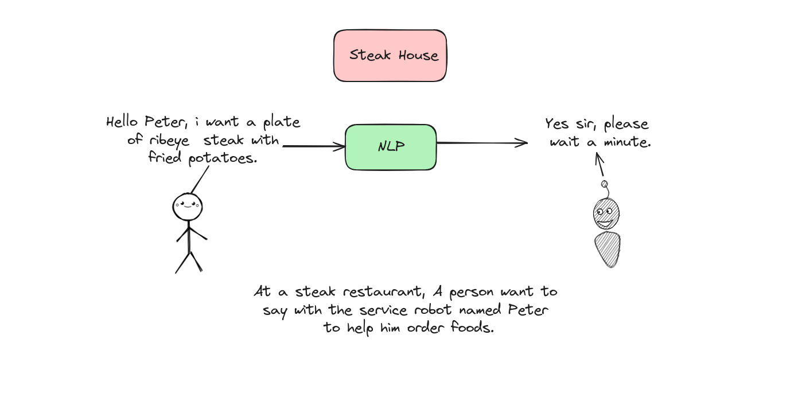
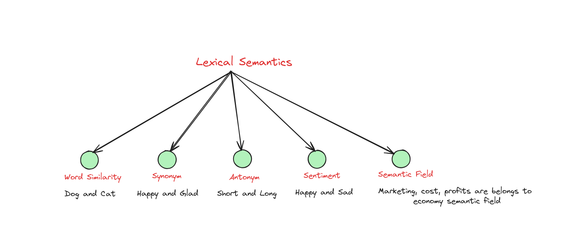
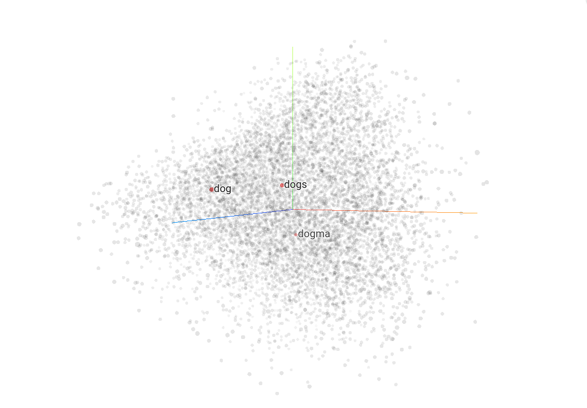
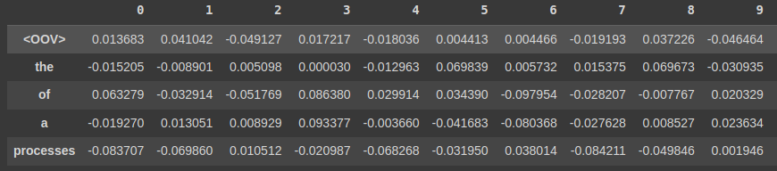
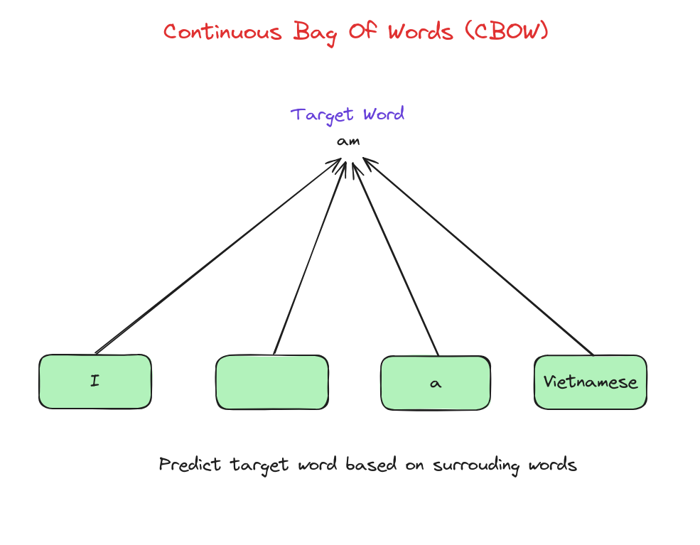

# Word Embeddding

## Introduction

Word Embeddings is a powerful technique in NLP for representing words in a continuous vector space. Unlike traditional text representations, word embeddings capture semantic relationships between words, allowing models to understand context and meaning. In this lesson, we'll explore popular methods like Word2Vec and GloVe, understand how embeddings are trained, and see their applications in various NLP tasks.

By the end, we'll be equipped to use word embeddings to enhance our text analysis and machine learning models.

## Natural Language Processing
Natural Language Processing (NLP) is a branch of Artificial Intelligence. It can help machines have a capable of reading, understanding and infering our languages.




## NLP development
Nowadays, NLP has achieve of many memorible milestons. First of all is the appearance of Word2Vec, which is the way a sentence or word is represented by a defined number. Then to improve this representation, attention mechanism was born, which is the premise for the invention of transformer model, the breakthough in AI research and a lot of models are taking over the world such as Gpt-4, Gemeni, LLama2.


However, all of these models can not work well without having a strong representation of our language called **Word Embedding**. Let's find out challenges of buiding Word Embedding in first days and the way NLP researchers solve these problems. 


## Word Embedding challenges

Three difficulties we have to handle when building a word embedding system are:
- Ambiguous.
- Idioms.
- Meaning depends on context.


In this example, we can not know which meaning of "The old man the boats" is really is. We have to base on surround sentences to decide the meaning of that sentence so embedding has to be different on each case. Idioms are also hard case to represent. 
 
## Tokenizer 
Tokenizer is the division of sentences, phrases, paragraphs or an entire document into multiple units, which can be words or letters. Each of these units is also called a token. 


In recent days, there are advanced tokenize techniques that used in many SOTA (state-of-the-art) models we must to know such as Byte-Pair Encoding, WordPiece, SentencePiece.

## Lexical Semantics

Lexical semantics is the branch of linguistics that deals with the meanings and relationships of words. It examines how words are structured, interpreted, and related to each other within a language.



Let's talk about **Word Similarity** aspect with 2 words "dog" and "cat". Although, cat is not synonym with dog but they are similar to each other on the edge of meanings. The way we say "dog is very lovely" and "cat is very lovely" are so similar. The way we consider lexical semantics on a pair of words help us build Word Embedding later.

## Semantic vector
Semantic vector is a representation of a word in multidimentional semantic space, which is built on the relationships between that word and surrouding words.

Two words are near in the semantic space will have the same semantic.


**Note:** to playaround with semantic vector, we can visit [Tensorflow Projector](https://projector.tensorflow.org/).

## Embeddings
Embedding is a set of semantic vectors. The term "semantic" in the context of embeddings emphasizes that these vectors are not arbitrary but are specifically designed to capture and represent the meanings and relationships of words within a language, enabling more nuanced and effective NLP tasks.


## Embedding Types

### One Hot Vector
One Hot Encoding turns each token into a binary vector. First, each token is assigned an integer value. Then, each integer is represented as a binary vector, where all values are 0 except for the position of the integer, which is marked by 1.


### Bag of Words (BoW)
A bag of words simply notes which words appear in a document and how often they occur. It doesn't consider grammar or word order.


### Bag of n-grams
In Bag of Words, phrases and word order aren't considered. The Bag of n-grams approach addresses this by breaking the text into groups of n consecutive words.


### TF-IDF(Term Frequency – Inverse Document Frequency)
In the methods mentioned earlier, every word holds equal weight. However, TF-IDF evaluates the significance of a word within the corpus.

+ Term Frequency (TF): Measures how often a word appears in a document, calculated as the ratio of the word's occurrences to the total number of terms in the document.

+ Inverse Document Frequency (IDF): Measures the word's importance across the corpus by reducing the weight of common terms and increasing the weight of rare terms.

+ TF-IDF Score: The product of TF and IDF.

The figure below illustrates the calculation of TF-IDF.


Furthermore, the following shows the implementation of TF-IDF in Python.

```shell
import nltk 
nltk.download('punkt') # Download 'punkt' 
# from nltk if it's not downloaded 
from sklearn.feature_extraction.text import TfidfVectorizer 

sentences = ["I love Vietnam", "Vietnamese people are pretty friendly",\
             "I love cooking", "I am Vietnamese"]  

# TF-IDF 
tfidf = TfidfVectorizer() 
tfidf_matrix = tfidf.fit_transform(sentences) 
  
# All words in the vocabulary. 
print("vocabulary", tfidf.get_feature_names_out()) 
# IDF value for all words in the vocabulary 
print("IDF for all words in the vocabulary :\n", tfidf.idf_) 
  
# TFIDF representation for all documents in our corpus 
print('\nTFIDF representation for "{}" is \n{}'
      .format(sentences[0], tfidf_matrix[0].toarray())) 
print('TFIDF representation for "{}" is \n{}'
      .format(sentences[1], tfidf_matrix[1].toarray())) 
print('TFIDF representation for "{}" is \n{}'
      .format(sentences[2],tfidf_matrix[2].toarray())) 
  
# TFIDF representation for a new text 
matrix = tfidf.transform(["learning dsa from geeksforgeeks"]) 
print("\nTFIDF representation for  'learning dsa from geeksforgeeks' is\n", 
      matrix.toarray())
```

which outputs:
```shell
vocabulary ['am' 'are' 'cooking' 'friendly' 'love' 'people' 'pretty' 'vietnam'
 'vietnamese']
IDF for all words in the vocabulary :
 [1.91629073 1.91629073 1.91629073 1.91629073 1.51082562 1.91629073
 1.91629073 1.91629073 1.51082562]

TFIDF representation for "I love Vietnam" is 
[[0.         0.         0.         0.         0.6191303  0.
  0.         0.78528828 0.        ]]
TFIDF representation for "Vietnamese people are pretty friendly" is 
[[0.         0.46516193 0.         0.46516193 0.         0.46516193
  0.46516193 0.         0.36673901]]
TFIDF representation for "I love cooking" is 
[[0.         0.         0.78528828 0.         0.6191303  0.
  0.         0.         0.        ]]

TFIDF representation for  'I love vietnamese people' is
 [[0.         0.         0.         0.         0.52640543 0.66767854
  0.         0.         0.52640543]]
```


In this our scope, we will discuss about **Word2Vec**, that is a **Word Embedding** technique used in many models nowadays. 

## Word Embeddings
Word embeddings are a way of representing words as dense vectors in a continuous vector space where the similarity between words is captured by the proximity of their vectors. Normally, we will use [cosine similarity](https://en.wikipedia.org/wiki/Cosine_similarity) that is a standard method to determine how close two vectors are in terms of their direction, to calculate the proximity of 2 vectors.

Word Embedding is usually used to represent words before feeding into NLP models.

These vectors are short and dense.


## Word2Vec 
Word2Vec is a static embedding, one word is represented on a fixed embedding

This is a weakness of Word2Vec so we need new techniques such as **ELMO** or **BERT** and latest technique is **Attention**, which can represent dynamic contextual embedding. It means one word can be represented on different vectors depend on different context. We will talk about this in another lesson.



## Word2Vec mechanism


Every word we feed into Word2Vec, it will convert this word into an embedding vector that we use for NLP models.

There are two ways to build Word2Vec by ourselves: **Continuous Bag Of Words (CBOW)** and **Skip Gram**. 

## Continuous Bag Of Words (CBOW)
Continuous Bag of Words (CBOW) is a type of word embedding model used in natural language processing (NLP). It aims to predict the target word based on the context of surrounding words within a fixed window size.
### How CBOW works



These word embeddings that generated by CBOW can then be used for various NLP tasks like sentiment analysis, language modeling, and machine translation.

## Skip Gram
The Skip-gram model is another type of word embedding model used in NLP. Unlike CBOW, which predicts a target word based on its surrounding context, Skip-gram predicts the context words based on a target word.

### How Skip Gram works


Skip Gram will be used when we want to capture nuanced semantic relationships between words, or are interested in rare words and need a large of dataset to train. Otherwhile, if we have a small dataset or want to capture the overall semantic meaning of a text, CBOW might be a good choice. Silimar to CBOW, Skip Gram can be used for various NLP tasks like sentiment analysis, language modeling, and machine translation.

## Implement CBOW Word2Vec
Now, we will build CBOW Word2Vec to embedding words.

### Import necessary libraries
```shell
import numpy as np
import tensorflow as tf
from tensorflow.keras.utils import to_categorical
from tensorflow.keras.preprocessing.text import Tokenizer
from tensorflow.keras.preprocessing.sequence import pad_sequences
from tensorflow.keras.preprocessing.text import text_to_word_sequence
from tensorflow.keras.models import Sequential
from tensorflow.keras.layers import Dense, Embedding, Lambda
from tensorflow.keras.backend import mean
```

### Create a small dataset
```shell
sentences = """We are about to study the idea of a computational process.
Computational processes are abstract beings that inhabit computers.
As they evolve, processes manipulate other abstract things called data.
The evolution of a process is directed by a pattern of rules called a program. People create programs to direct processes. In effect,
we conjure the spirits of the computer with our spells."""

corpus = sentences.split(".")[:-1]
corpus = [sentence.strip() + "." for sentence in corpus]
print(corpus)

['We are about to study the idea of a computational process.',
'Computational processes are abstract beings that inhabit computers.',
'As they evolve, processes manipulate other abstract things called data.',
'The evolution of a process is directed by a pattern of rules called a program.',
'People create programs to direct processes.',
'In effect,\nwe conjure the spirits of the computer with our spells.']
```

### Build tokenizer
```shell
for i in range(len(corpus)):
  corpus[i] = text_to_word_sequence(corpus[i])

# Show some words in the corpus
tokenizer = Tokenizer(oov_token='<OOV>')
tokenizer.fit_on_texts(corpus)
w2id = tokenizer.word_index
print(w2id)

{'<OOV>': 1,
 'the': 2,
 'of': 3,
 'a': 4,
 'processes': 5,
 'we': 6,
 'are': 7,
 'to': 8,
 'computational': 9,
 'process': 10,
 'abstract': 11,
 ...
 'spirits': 41,
 'computer': 42,
 'with': 43,
 'our': 44,
 'spells': 45}
```

### Preprocessing for CBOW
```shell
# Define some parameters
vocab_size = len(tokenizer.word_index) + 1
window_size = 2

def generate_pairs(window_size, corpus):
  X = []
  y = []
  for words in corpus:
    start = 0
    while start + window_size * 2 < len(words):
      end = start + window_size * 2
      tar_i = start + window_size

      # Select the current word as the label
      label = words[tar_i]

      # Join k words on the left and k words on the right of this word into 1 sentence
      x = [" ".join(words[start:tar_i] + words[tar_i+1:end+1])]

      print(words)
      print(x, "--->", label)
      start += 1
      X.append(tokenizer.texts_to_sequences(x)[0])
      y.append(to_categorical( tokenizer.word_index[label], len(tokenizer.word_index) + 1))

  return tf.convert_to_tensor(X) , tf.convert_to_tensor(y)
X_train, y_train = generate_pairs(window_size, corpus)
```

### Building CBOW
CBOW model included:
- 1 embedding layer with defined dimention.
- 1 dense layer to map from embedding dimention to dictionary dimention.

```shell
embedding_size = 128
cbow = Sequential()
cbow.add(Embedding(input_dim=vocab_size, output_dim=embedding_size, input_length=window_size*2))
cbow.add(Lambda(lambda x: mean(x, axis=1), output_shape=(embedding_size,) ))
cbow.add(Dense(vocab_size, activation='softmax'))
print(cbow.summary())

Model: "sequential"
_________________________________________________________________
 Layer (type)                Output Shape              Param #   
=================================================================
 embedding (Embedding)       (None, 4, 128)            5888      
                                                                 
 lambda (Lambda)             (None, 128)               0         
                                                                 
 dense (Dense)               (None, 46)                5934      
                                                                 
=================================================================
Total params: 11822 (46.18 KB)
Trainable params: 11822 (46.18 KB)
Non-trainable params: 0 (0.00 Byte)
_________________________________________________________________
```

### Training CBOW
```shell
cbow.compile(loss='categorical_crossentropy', optimizer='adam', metrics=['acc'])
cbow.fit(X_train, y_train, epochs=30, verbose=1)
```

### Test the model's ability to generate words
```shell
example = 'processes are beings that'
example = text_to_word_sequence(example)
example = tokenizer.texts_to_sequences([example])
example = tf.convert_to_tensor(example)
cbow.predict(example)
tokenizer.index_word[np.argmax(cbow.predict(example))]

1/1 [==============================] - 0s 93ms/step
1/1 [==============================] - 0s 16ms/step
abstract
```

### Show embedding
```shell
weights = cbow.get_weights()[0]
import pandas as pd
weights = cbow.get_weights()[0]
weights = weights[1:]
pd.DataFrame(weights, index=list(tokenizer.index_word.values()))
```

## Conclusion

In this lesson, we dove into the world of Word Embeddings, an essential technique in NLP that transforms words into continuous vector spaces, capturing their meanings and relationships. We explored popular methods like Word2Vec and GloVe, seeing how they enable models to grasp context and semantic nuances. 

Now, with this powerful tool, we can enhance our text analysis and create smarter, more intuitive machine learning models.

## References

+ “What are Word Embeddings? | IBM,” www.ibm.com. https://www.ibm.com/topics/word-embeddings
+ J. Alammar, “The Illustrated Word2vec,” jalammar.github.io, Mar. 27, 2019. https://jalammar.github.io/illustrated-word2vec/
+ N. Barla, “The Ultimate Guide to Word Embeddings,” neptune.ai, Jul. 21, 2022. https://neptune.ai/blog/word-embeddings-guide

