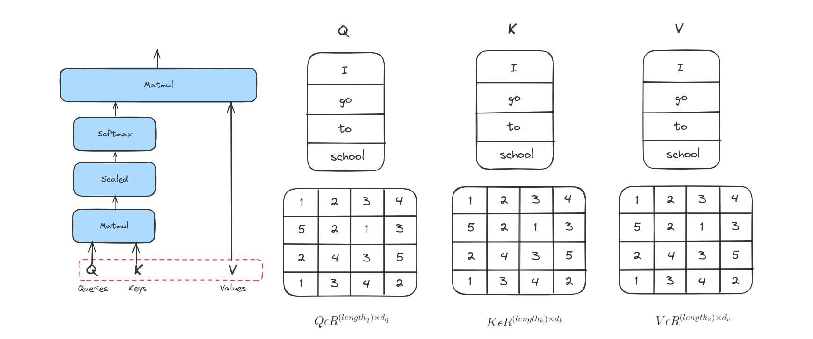
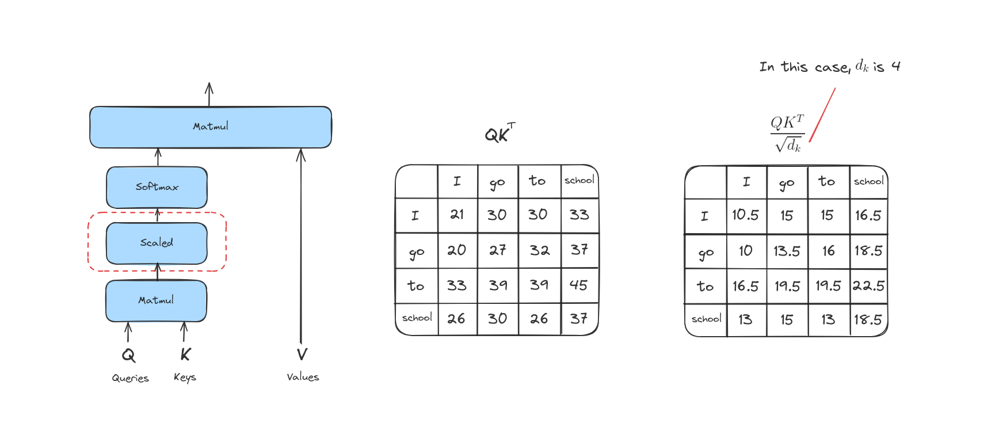

# Attention is all you need

## Introduction

Tiêu đề này đề cập đến một bài báo nổi tiếng đánh dấu bước tiến quan trọng trong lĩnh vực NLP. Việc giới thiệu Attention không chỉ giúp cải thiện biểu diễn từ (word embedding - nhúng từ) mà còn khắc phục các hạn chế của mô hình CBOW và Skip Gram.

## What is Attention?

Attention là một cơ chế trong học máy cho phép mô hình tập trung vào những phần quan trọng của dữ liệu đầu vào trong quá trình xử lý. Nó giúp mô hình gán các trọng số khác nhau cho từng phần của đầu vào, từ đó ưu tiên thông tin liên quan và bỏ qua các chi tiết không cần thiết. Điều này giúp mô hình dự đoán chính xác hơn hoặc tạo ra các kết quả đầu ra có ý nghĩa hơn.

Trong NLP, cơ chế Attention đặc biệt hữu ích cho các bài toán như dịch máy (machine translation), tóm tắt văn bản (text summarization) và phân tích cảm xúc (sentiment analysis).

## Attention hoạt động như thế nào?
### Information Retrieval
Cơ chế hoạt động của Attention khá giống với information retrieval, vì vậy  ta sẽ nói về truy hồi thông tin trước.

Cậu bé trong hình muốn tìm kiếm các video liên quan đến AI, nên cậu tìm kiếm trên YouTube. YouTube sẽ chuyển yêu cầu của cậu thành các giá trị, ví dụ AI là 1 và Leetcode là 0. Sau đó, YouTube sẽ tìm kiếm tất cả các video và chỉ trả về các video liên quan đến AI cho cậu bé.

### Attention workflow
### Quy trình hoạt động của Attention
#### Bước 1
Bước đầu tiên trong việc tính toán Attention là tạo ra ba vector từ mỗi vector đầu vào của encoder. Như vậy, với mỗi từ, chúng ta tạo ra 3 vector Query, Key, Value. Trong ví dụ này, ta giả sử Query, Key và Value là giống nhau.

#### Bước 2
Bước tiếp theo là tính score. Giả sử  ta đang tính attention cho từ đầu tiên trong ví dụ này, "I". Ta cần tính điểm cho từng từ trong câu đầu vào so với từ này. Score này quyết định mức độ tập trung vào các phần khác nhau của câu khi mã hóa một từ ở vị trí nhất định.

Điểm số được tính bằng cách lấy tích vô hướng (dot product) giữa vector query và vector key của từng từ. Ví dụ, nếu đang xử lý attention cho từ ở vị trí đầu tiên, điểm đầu tiên sẽ là tích vô hướng giữa q1 và k1, điểm thứ hai là giữa q1 và k2, v.v.

### Bước 3
Bước này là chia các score vừa tính được cho căn bậc hai của kích thước vector khóa (key vector dimension). Việc này giúp ổn định giá trị score khi số chiều của vector lớn.

### Bước 4
Các score sau khi được chia sẽ đi qua hàm softmax. Softmax sẽ chuẩn hóa các score này thành các giá trị dương và tổng của chúng bằng 1.

Giá trị softmax này quyết định mức độ mỗi từ sẽ được thể hiện tại vị trí hiện tại. Thông thường, từ tại vị trí đó sẽ có điểm softmax cao nhất, nhưng đôi khi cũng cần chú ý đến các từ khác có liên quan.

### Bước 5
Bước này là nhân mỗi vector giá trị với điểm softmax tương ứng. Ý tưởng ở đây là giữ nguyên giá trị của những từ mà ta muốn tập trung, và làm giảm ảnh hưởng của các từ không liên quan (bằng cách nhân với các số rất nhỏ như 0.001).

### Bước 6
Bước cuối cùng là cộng tất cả các vector giá trị đã được nhân trọng số lại với nhau. Kết quả này chính là đầu ra của lớp self-attention tại vị trí đó (ví dụ với từ đầu tiên là "I").

Đây là toàn bộ các bước để hiểu cách cơ chế Attention hoạt động.

## Kết luận

Tóm lại, ta đã tìm hiểu về cách cơ chế Attention hoạt động cũng như cách nó giúp mạng nơ-ron tập trung vào những phần quan trọng nhất của dữ liệu đầu vào. Bằng cách gán trọng số động cho các thành phần, Attention giúp cải thiện các tác vụ như dịch máy và tóm tắt văn bản, làm cho mô hình thông minh và hiệu quả hơn.

## Tài liệu tham khảo

+ A. Vaswani et al., “Attention Is All You Need,” arXiv.org, Jun. 12, 2017. https://arxiv.org/abs/1706.03762