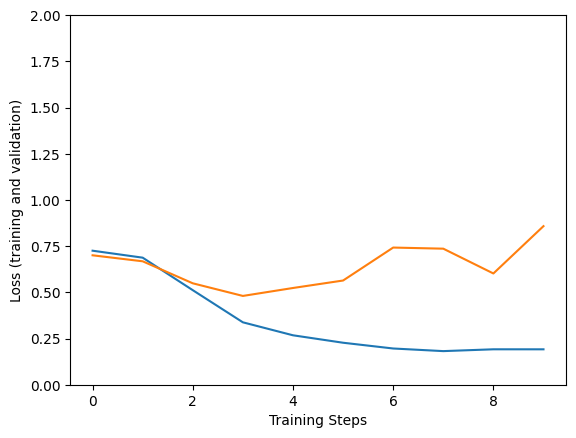
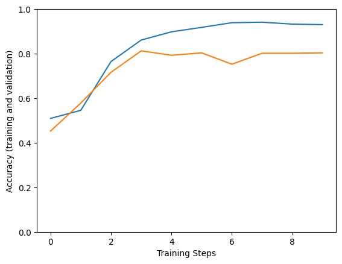

# Attention is all you need

## Introduction

Tiêu đề này cũng đề cập đến một bài báo nổi tiếng đánh dấu bước tiến quan trọng trong lĩnh vực Xử lý ngôn ngữ tự nhiên (NLP - Natural Language Processing). Việc giới thiệu Attention (Cơ chế chú ý) không chỉ giúp cải thiện biểu diễn từ (word embedding - nhúng từ) mà còn khắc phục các hạn chế của mô hình CBOW và Skip Gram.

## What is Attention?


Attention (Cơ chế chú ý) là một cơ chế trong học máy (machine learning) cho phép mô hình tập trung vào những phần quan trọng của dữ liệu đầu vào trong quá trình xử lý. Nó giúp mô hình gán các trọng số khác nhau cho từng phần của đầu vào, từ đó ưu tiên thông tin liên quan và bỏ qua các chi tiết không cần thiết. Điều này giúp mô hình dự đoán chính xác hơn hoặc tạo ra các kết quả đầu ra có ý nghĩa hơn.

Trong lĩnh vực xử lý ngôn ngữ tự nhiên (NLP), cơ chế Attention đặc biệt hữu ích cho các bài toán như dịch máy (machine translation), tóm tắt văn bản (text summarization) và phân tích cảm xúc (sentiment analysis).


## Attention hoạt động như thế nào?
### Truy hồi thông tin (Information Retrieval)
Cơ chế hoạt động của Attention khá giống với truy hồi thông tin (information retrieval), vì vậy chúng ta sẽ nói về truy hồi thông tin trước.


Cậu bé trong hình muốn tìm kiếm các video liên quan đến AI, nên cậu gửi yêu cầu lên YouTube. YouTube sẽ chuyển yêu cầu của cậu thành các giá trị, ví dụ AI là 1 và Leetcode là 0. Sau đó, YouTube sẽ tìm kiếm tất cả các video và chỉ trả về các video liên quan đến AI cho cậu bé.

### Attention workflow
### Quy trình hoạt động của Attention
#### Bước 1
Bước đầu tiên trong việc tính toán Attention là tạo ra ba vector từ mỗi vector đầu vào của encoder. Như vậy, với mỗi từ, chúng ta tạo ra một vector Truy vấn (Query), một vector Khóa (Key) và một vector Giá trị (Value). Trong ví dụ này, ta giả sử Query, Key và Value là giống nhau.


#### Bước 2
Bước tiếp theo là tính toán điểm số (score). Giả sử chúng ta đang tính attention cho từ đầu tiên trong ví dụ này, "I". Ta cần tính điểm cho từng từ trong câu đầu vào so với từ này. Điểm số này quyết định mức độ tập trung vào các phần khác nhau của câu khi mã hóa một từ ở vị trí nhất định.

Điểm số được tính bằng cách lấy tích vô hướng (dot product) giữa vector truy vấn (query) và vector khóa (key) của từng từ. Ví dụ, nếu đang xử lý attention cho từ ở vị trí đầu tiên, điểm đầu tiên sẽ là tích vô hướng giữa q1 và k1, điểm thứ hai là giữa q1 và k2, v.v.


### Bước 3
Bước này là chia các điểm số vừa tính được cho căn bậc hai của kích thước vector khóa (key vector dimension). Việc này giúp ổn định giá trị điểm số khi số chiều của vector lớn.


### Bước 4
Các điểm số sau khi được chia sẽ đi qua hàm softmax. Softmax sẽ chuẩn hóa các điểm số này thành các giá trị dương và tổng của chúng bằng 1.


Giá trị softmax này quyết định mức độ mỗi từ sẽ được thể hiện tại vị trí hiện tại. Thông thường, từ tại vị trí đó sẽ có điểm softmax cao nhất, nhưng đôi khi cũng cần chú ý đến các từ khác có liên quan.

### Fifth step

### Bước 5
Bước này là nhân mỗi vector giá trị (value vector) với điểm softmax tương ứng. Ý tưởng ở đây là giữ nguyên giá trị của những từ mà ta muốn tập trung, và làm giảm ảnh hưởng của các từ không liên quan (bằng cách nhân với các số rất nhỏ như 0.001).


### Bước 6 (nếu không sử dụng phép tính ma trận như các hình trên)
Bước cuối cùng là cộng tất cả các vector giá trị đã được nhân trọng số lại với nhau. Kết quả này chính là đầu ra của lớp self-attention tại vị trí đó (ví dụ với từ đầu tiên là "I").


Như vậy, trên đây là toàn bộ các bước để hiểu cách cơ chế Attention hoạt động.

## Implementing attention
We are going to build a simple Attention model to solve sentiment analysis problem. Let's start.

### Importing necessary libraries
This implementation was conducted on Google Colab.

```python
import os
import re
import seaborn as sns
from tqdm import tqdm
import pandas as pd
import numpy as np
import tensorflow as tf
print('tensorflow version:',tf.__version__)
import keras.backend as K
from keras.layers import Layer
import matplotlib.pylab as plt
from tensorflow.keras.preprocessing.text import Tokenizer 
from tensorflow.keras.preprocessing.sequence import pad_sequences
from tensorflow.keras.layers import LSTM, InputLayer, Dense, Embedding, Input, Attention, Flatten
from tensorflow.keras import Model
from sklearn.model_selection import train_test_split
```

### Loading datasets
```python
!wget https://raw.githubusercontent.com/dunghoang369/data/main/imdb_labelled.txt
!wget https://raw.githubusercontent.com/dunghoang369/data/main/amazon_cells_labelled.txt
!wget https://raw.githubusercontent.com/dunghoang369/data/main/yelp_labelled.txt

# Load datasets
imdb = pd.read_csv('amazon_cells_labelled.txt', sep="	", )
imdb.columns = ['text','label']
amazon = pd.read_csv('imdb_labelled.txt', sep="	", header = None)
amazon.columns = ['text','label']
yelp = pd.read_csv('yelp_labelled.txt', sep="	", header = None)
yelp.columns = ['text','label']

# Concatenation 
data = pd.concat([imdb,amazon,yelp])
```

### Preprocessing datasets
```python
# Làm sạch dữ liệu văn bản
def clean_text(dataset):
    for i in range(dataset.shape[0]):
        sentence=dataset.iloc[i,0]
        sentence=re.sub('[^A-Za-z0-9]+', ' ', str(sentence).lower()).strip()
        dataset.iloc[i,0]=sentence
    return data

corpus = clean_text(data)

# Xây dựng tokenizer (bộ mã hóa từ)
tokenizer = Tokenizer(num_words=1000,filters='!"#$%&()*+,-./:;<=>?@[\\]^_`{|}~\t\n')
tokenizer.fit_on_texts(corpus['text'])

# Chuyển văn bản thành chuỗi số
text_matrix = tokenizer.texts_to_sequences(corpus['text'])
text_pad = pad_sequences(text_matrix, maxlen=32, padding='post') 
```

### Creating data to train the model
```python
# Tạo dữ liệu huấn luyện cho mô hình
x_train = np.array(text_pad)
y_train = np.array(corpus['label'])
```

### Building an small attention model
```python
# Xây dựng một mô hình attention nhỏ
vocab_length = 3000
# Mô hình với cơ chế attention
inputs = Input(shape=(text_pad.shape[1],))
x = Embedding(input_dim=vocab_length+1, output_dim=32,\
             input_length=text_pad.shape[1], embeddings_regularizer=tf.keras.regularizers.l2(.001))(inputs)
x1 = tf.keras.layers.Conv1D(
    filters=100,
    kernel_size=4,
    # Sử dụng padding 'same' để đầu ra có cùng kích thước với đầu vào
    padding='same')(x)
atte_layer = Attention()([x1, x1])
flatten = Flatten()(atte_layer)
outputs = Dense(1, activation='sigmoid', trainable=True)(flatten)
model = Model(inputs,outputs)
model.summary()

Model: "model_5"
__________________________________________________________________________________________________
 Layer (type)                Output Shape                 Param #   Connected to                  
==================================================================================================
 input_18 (InputLayer)       [(None, 32)]                 0         []                            
                                                                                                 
 embedding_19 (Embedding)    (None, 32, 32)               96032     ['input_18[0][0]']            
                                                                                                 
 conv1d_5 (Conv1D)           (None, 32, 100)              12900     ['embedding_19[0][0]']        
                                                                                                 
 attention_13 (Attention)    (None, 32, 100)              0         ['conv1d_5[0][0]',            
                                                                     'conv1d_5[0][0]']            
                                                                                                 
 flatten_3 (Flatten)         (None, 3200)                 0         ['attention_13[0][0]']        
                                                                                                 
 dense_7 (Dense)             (None, 1)                    3201      ['flatten_3[0][0]']           
                                                                                                 
==================================================================================================
Tổng số tham số: 112133 (438.02 KB)
Tham số huấn luyện được: 112133 (438.02 KB)
Tham số không huấn luyện: 0 (0.00 Byte)
```

### Training the attention model
history = model.fit(x_train,y_train,epochs=10, validation_split=0.2,verbose=1,batch_size=64,shuffle=True).history
```python
# Huấn luyện mô hình attention
model.compile(loss='binary_crossentropy', optimizer='adam', metrics=['accuracy'])
history = model.fit(x_train, y_train, epochs=10, validation_split=0.2, verbose=1, batch_size=64, shuffle=True).history
```

### Visualize training model's history
```python
# Trực quan hóa quá trình huấn luyện mô hình
plt.figure()
plt.ylabel("Loss (training and validation) - Độ mất mát (huấn luyện và kiểm tra)")
plt.xlabel("Training Steps - Số bước huấn luyện")
plt.ylim([0,2])
plt.plot(history["loss"])
plt.plot(history["val_loss"])

plt.figure()
plt.ylabel("Accuracy (training and validation) - Độ chính xác (huấn luyện và kiểm tra)")
plt.xlabel("Training Steps - Số bước huấn luyện")
plt.ylim([0,1])
plt.plot(history["accuracy"])
plt.plot(history["val_accuracy"])
```





### Inference
```python
# Dự đoán (Inference)
def inference(text):
    # Hàm dự đoán cảm xúc cho một câu đầu vào
    text_matrix = tokenizer.texts_to_sequences([text])
    text_pad = pad_sequences(text_matrix, maxlen=32, padding='post')
    result = model.predict(text_pad)
    if result[0][0] > 0.5:
        return "Tích cực (Positive)"
    else:
        return "Tiêu cực (Negative)"

print(inference("Saw the movie today and thought it was a good effort, good messages for kids."))
# Kết quả: Tích cực (Positive)
```

## Kết luận

Tóm lại, chúng ta đã tìm hiểu về cách cơ chế Attention hoạt động cũng như cách nó giúp mạng nơ-ron tập trung vào những phần quan trọng nhất của dữ liệu đầu vào. Bằng cách gán trọng số động cho các thành phần, Attention giúp cải thiện các tác vụ như dịch máy và tóm tắt văn bản, làm cho mô hình thông minh và hiệu quả hơn.

## Tài liệu tham khảo

+ A. Vaswani et al., “Attention Is All You Need,” arXiv.org, Jun. 12, 2017. https://arxiv.org/abs/1706.03762