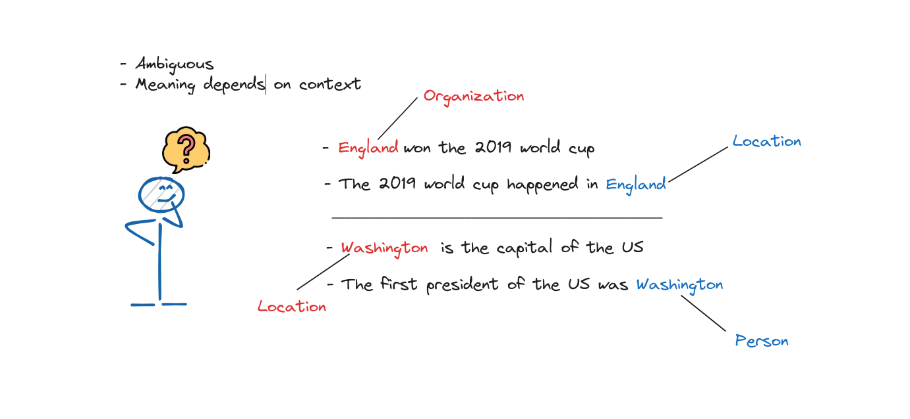
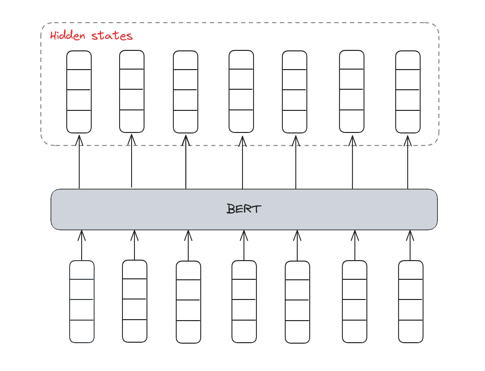
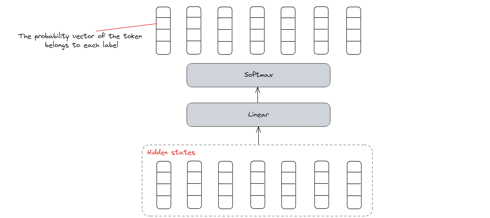

# Name Entity Recognition

## Introduction

Named Entity Recognition (NER) is a key task in Natural Language Processing (NLP) that involves identifying and classifying entities in text, such as names of people, organizations, locations, dates, and more. This lesson will cover the basics of NER, its applications, and techniques for implementing NER models.

By the end, we'll understand how to extract valuable information from text using NER.

## What is Name Entity Recognition?
Named Entity Recognition (NER), which is one kind of token classification problems, is a component of Natural Language Processing (NLP) dedicated to identifying and categorizing named entities like individuals' names, organizations, places, medical codes, time references, amounts, monetary figures, and other types but in our scope we will only classify tokens as persons, locations, organizations, miscellaneous for others and None for nothing. Recognizing these entities is vital in various NLP applications as they typically carry the most critical information within a text.


## Name Entity problems

With these above examples, we can not know exactly the word mentions to without surrounding words. The ambiguous and context dependency are popular problems when dealing with NLP tasks.

## Name Entity Recognition Methods
There are a lot of methods to extract and categorize words but each method has different strength and weakness such as **Rule-based method**, **Statistical method**, **Machine Learning method** and **Deep Learning method**. With the appearance of Bert, which is built on the Encoder of Transformer architecture, **Deep Learning method** can handle ambiguous and context dependency challengings better than other methods thanks to **Attention** mechanism help learning context better. 

Therefore, we will implement **Bert** model to solve this problem in later session.


## How it works?
### Tokenization
Similar to various NLP tasks, the text need to be split into tokens, which can be words, phrases, or even sentences.


### Embeddings
From these indexes, we need to represent them by different contextual vectors using combinating of Word Embedding and Positional Embedding.


### Enhance Embedding using BERT
BERT is invented based on the Encoder of Transformer with the core component is bidirectional attention machenism. Therefore, BERT is used for representing words, which is a breakthrough in NLP research.


#### Linear Classifier
We need a classifier which comprises of a linear layer with Softmax activation to calculate the probability of each token belongs to each label.


Here we go, it's time to write some scripts to solve Name Entity Recognition task.

## Implement NER
In this session, we will use HuggingFace library for easy implementiontion.

### Install HuggingFace libraries's ecosystem
```python
pip install transformers[torch] datasets seqeval evaluate
```

### Import necessary libraries
```python
import evaluate
import numpy as np
from tqdm.auto import tqdm
from transformers import Trainer
from datasets import load_dataset
from transformers import pipeline
from transformers import get_scheduler
from torch.utils.data import DataLoader
from transformers import AutoTokenizer
from transformers import TrainingArguments
from transformers import AutoModelForTokenClassification
from transformers import DataCollatorForTokenClassification
```


### Load dataset
We load the CoNLL-2003 dataset by using **load_dataset()** from the Dataset library.
```python
raw_datasets = load_dataset("conll2003")
print(raw_datasets)

DatasetDict({
    train: Dataset({
        features: ['id', 'tokens', 'pos_tags', 'chunk_tags', 'ner_tags'],
        num_rows: 14041
    })
    validation: Dataset({
        features: ['id', 'tokens', 'pos_tags', 'chunk_tags', 'ner_tags'],
        num_rows: 3250
    })
    test: Dataset({
        features: ['id', 'tokens', 'pos_tags', 'chunk_tags', 'ner_tags'],
        num_rows: 3453
    })
})
```

This dataset has already split into the training, validation, and test sets for us. We only need to get **tokens** and **ner_tags** features for this task.

Then, we show some example samples.
```python
print(raw_datasets["train"][0]["tokens"])
print(raw_datasets["train"][0]["ner_tags"])

['EU', 'rejects', 'German', 'call', 'to', 'boycott', 'British', 'lamb', '.']
[3, 0, 7, 0, 0, 0, 7, 0, 0]
```
So, what **ner_tags** represents for? We need to know each integer belongs to which class.

```python
ner_feature = raw_datasets["train"].features["ner_tags"]
label_names = ner_feature.feature.names
print(label_names)

['O', 'B-PER', 'I-PER', 'B-ORG', 'I-ORG', 'B-LOC', 'I-LOC', 'B-MISC', 'I-MISC']
```

Therefore, we have this dictionary of labels.

```python
{0: 'O',
 1: 'B-PER',
 2: 'I-PER',
 3: 'B-ORG',
 4: 'I-ORG',
 5: 'B-LOC',
 6: 'I-LOC',
 7: 'B-MISC',
 8: 'I-MISC'}
```

### Load tokenizer
```python
# Load bert tokenizer
model_checkpoint = "bert-base-cased"
tokenizer = AutoTokenizer.from_pretrained(model_checkpoint)

# Tokenize an example sentence
inputs = tokenizer(raw_datasets["train"][0]["tokens"], is_split_into_words=True)
labels = raw_datasets["train"][0]["ner_tags"]
print("Tokens: ", inputs.tokens())
print("Word indexes: ", inputs.word_ids())
print("Labels: ", labels)

Tokens:  ['[CLS]', 'EU', 'rejects', 'German', 'call', 'to', 'boycott', 'British', 'la', '##mb', '.', '[SEP]']
Word indexes:  [None, 0, 1, 2, 3, 4, 5, 6, 7, 7, 8, None]
Labels:  [3, 0, 7, 0, 0, 0, 7, 0, 0]
```
The tokenizer added the special tokens used by the model ([CLS] at the beginning and [SEP] at the end). Besides, the word lamb was tokenized into two subwords, la and ##mb. This lead to a mismatch between our inputs and the labels. We have to solve this problem.
```python
def align_labels_with_tokens(labels, word_ids):
    new_labels = []
    current_word = None
    for word_id in word_ids:
        if word_id != current_word:
            # Start of a new word!
            current_word = word_id
            label = -100 if word_id is None else labels[word_id]
            new_labels.append(label)
        elif word_id is None:
            # Special token
            new_labels.append(-100)
        else:
            # Same word as previous token
            label = labels[word_id]
            # If the label is B-XXX we change it to I-XXX
            if label % 2 == 1:
                label += 1
            new_labels.append(label)

    return new_labels
```
We will pad special tokens get a label of -100 to match our label list to the tokens (-100 is an index that is ignored in the loss function we will use). For tokens inside a word but not at the beginning, we replace the B- with I- (since the token does not begin the entity).

Try it out:
```python
labels = raw_datasets["train"][0]["ner_tags"]
word_ids = inputs.word_ids()
print("Labels: ", labels)
print("New labels: ", align_labels_with_tokens(labels, word_ids))

Labels:  [3, 0, 7, 0, 0, 0, 7, 0, 0]
New labels:  [-100, 3, 0, 7, 0, 0, 0, 7, 0, 0, 0, -100]
```

### Preprocess whole dataset
```python
def tokenize_and_align_labels(examples):
    tokenized_inputs = tokenizer(
        examples["tokens"], truncation=True, is_split_into_words=True
    )
    all_labels = examples["ner_tags"]
    new_labels = []
    for i, labels in enumerate(all_labels):
        word_ids = tokenized_inputs.word_ids(i)
        new_labels.append(align_labels_with_tokens(labels, word_ids))

    tokenized_inputs["labels"] = new_labels
    return tokenized_inputs

# Apply preprocessing functions for whole dataset
tokenized_datasets = raw_datasets.map(
    tokenize_and_align_labels,
    batched=True,
    remove_columns=raw_datasets["train"].column_names,
)
```

### Define data collator
We will use a DataCollatorForTokenClassification to gather many samples into one batch. This collator will help our labels be padded the exact same way as the inputs.

```python
data_collator = DataCollatorForTokenClassification(tokenizer=tokenizer)
```
Try some examples:
```python
batch = data_collator([tokenized_datasets["train"][i] for i in range(2)])
print(batch["labels"])

tensor([[-100,    3,    0,    7,    0,    0,    0,    7,    0,    0,    0, -100],
        [-100,    1,    2, -100, -100, -100, -100, -100, -100, -100, -100, -100]])
```

### Define evaluate metrics

```python
metric = evaluate.load("seqeval") # this metric will actually take the lists of labels as strings, not integers, so we will need to fully decode the predictions and labels

def compute_metrics(eval_preds):
    logits, labels = eval_preds
    predictions = np.argmax(logits, axis=-1)

    # Remove ignored index (special tokens) and convert to labels
    true_labels = [[label_names[l] for l in label if l != -100] for label in labels]
    true_predictions = [
        [label_names[p] for (p, l) in zip(prediction, label) if l != -100]
        for prediction, label in zip(predictions, labels)
    ]
    all_metrics = metric.compute(predictions=true_predictions, references=true_labels)
    return {
        "precision": all_metrics["overall_precision"],
        "recall": all_metrics["overall_recall"],
        "f1": all_metrics["overall_f1"],
        "accuracy": all_metrics["overall_accuracy"],
    }
```

### Define the model
```python
id2label = {i: label for i, label in enumerate(label_names)} # map from ID to label
label2id = {v: k for k, v in id2label.items()} # map from label to ID

model = AutoModelForTokenClassification.from_pretrained(
    model_checkpoint,
    id2label=id2label,
    label2id=label2id,
)
```

### Fine-tuning the model
#### Define training arguments
```python
args = TrainingArguments(
    "bert-finetuned-ner",
    evaluation_strategy="epoch",
    save_strategy="epoch",
    learning_rate=2e-5,
    num_train_epochs=3,
    weight_decay=0.01,
)
```
we set some hyperparameters such as the learning rate, the number of epochs to train for, and the weight decay.

#### Traning
```python
trainer = Trainer(
    model=model,
    args=args,
    train_dataset=tokenized_datasets["train"],
    eval_dataset=tokenized_datasets["validation"],
    data_collator=data_collator,
    compute_metrics=compute_metrics,
    tokenizer=tokenizer,
)
trainer.train()
```

### Inference
```python
# Replace this with your own checkpoint
model_checkpoint = "bert-finetuned-ner/checkpoint-5268"
token_classifier = pipeline(
    "token-classification", model=model_checkpoint, aggregation_strategy="simple"
)
token_classifier("My name is Sylvain and I work at Hugging Face in Brooklyn.")

[{'entity_group': 'PER',
  'score': 0.99520415,
  'word': 'Sylvain',
  'start': 11,
  'end': 18},
 {'entity_group': 'ORG',
  'score': 0.97790796,
  'word': 'Hugging Face',
  'start': 33,
  'end': 45},
 {'entity_group': 'LOC',
  'score': 0.99738187,
  'word': 'Brooklyn',
  'start': 49,
  'end': 57}]
```

## Conclusion

In this lesson, we explored Named Entity Recognition (NER), a crucial NLP task for identifying and classifying entities within text. We discussed the importance of NER, its applications, and various techniques for implementation. 

With this knowledge, we can now apply NER to extract meaningful information from unstructured text, enhancing our data analysis and understanding. 

## References

+ “Named Entity Recognition,” GeeksforGeeks, May 27, 2021. https://www.geeksforgeeks.org/named-entity-recognition/
+ “Token classification - Hugging Face NLP Course,” huggingface.co. https://huggingface.co/learn/nlp-course/chapter7/2 (accessed Jul. 07, 2024).
+ “What is named entity recognition? | IBM,” www.ibm.com. https://www.ibm.com/topics/named-entity-recognition