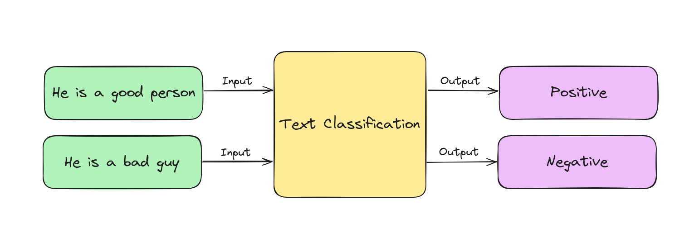
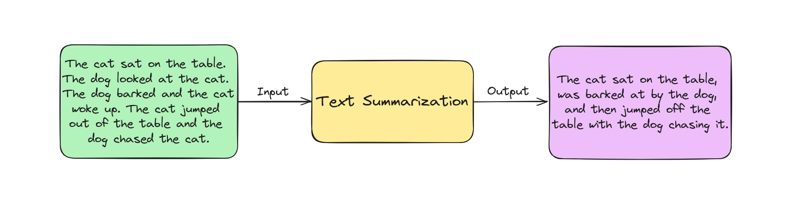
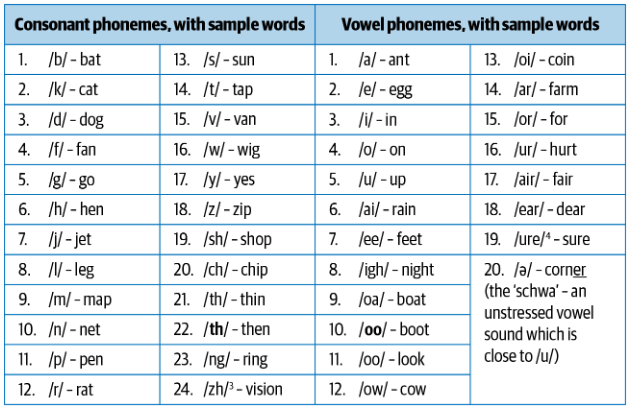

# Natural Language Processing in the Real World

## Introduction

NLP, short for Natural Language Processing, plays a vital role in many daily software applications. Key examples include:

1. **Email Platforms**: Services like Gmail and Outlook use NLP for spam classification, priority inbox, and auto-complete features.
2. **Voice-based Assistants**: Apple Siri, Google Assistant, Microsoft Cortana, and Amazon Alexa rely on NLP for user interaction and command response.
3. **Search Engines**: Google and Bing use NLP for query understanding, information retrieval, and result ranking.
4. **Machine Translation**: Google Translate and Amazon Translate apply NLP to facilitate communication and solve business scenarios.

Additionally, there are also other Applications of NLP:

1. Social Media Analysis: Organizations analyze social media to understand customer sentiments.
2. E-commerce: NLP extracts information from product descriptions and understands user reviews.
5. Spelling and Grammar Tools: Tools like Grammarly and spell check in word processors rely on NLP.

This list is not exhaustive, as NLP continues to expand into new applications. Our main goal is to introduce the concepts behind building these applications by discussing various NLP problems and their solutions. 

## NLP

In many NLP projects, there are common fundamental tasks that keep popping up. These tasks have been looked into a lot because they're important and come up often. If we understand them well, we'll be all set to create different NLP apps for different areas. Let's take a quick look at them.

### Language modeling

This task involves predicting the next word in a sentence by looking at the words that came before it. The aim is to understand the likelihood of certain word sequences in a language. It's handy for many things like speech recognition, translation, and fixing spelling errors.

### Text classification

This task involves categorizing text into predefined groups based on its content. It's widely used in NLP for tasks like identifying spam emails and analyzing sentiment.

### Information extraction

This task involves pulling out useful details from text, like identifying events from emails or recognizing people's names in social media posts. One of the most common tasks in information extraction is Name Entity Extraction (NER).

### Conversational agent

This task involves creating conversational systems capable of communicating in human languages, with examples including popular applications like Alexa and Siri.

### Text summarization

This task focuses on generating concise summaries of lengthy documents while maintaining the essential content and overall message.

### Question answering

This task involves constructing a system capable of providing automatic responses to questions asked in everyday language.

### Machine translation

This task involves translating text from one language to another, with tools like Google Translate being typical examples.

## What is Language?

Language is a complex system of communication structured around components like characters, words, and sentences. Linguistics, the study of language, provides essential insights for understanding NLP. In this section, we'll explore key linguistic concepts and their relevance to NLP tasks. Human language comprises phonemes, morphemes, lexemes, syntax, and context. NLP applications rely on understanding these elements, from basic sound units to meaningful expressions in context.

Linguistics is the study of language and hence is a vast area in itself, and we only introduced some basic ideas to illustrate the role of linguistic knowledge in NLP.

### Phonemes
Phonemes are the smallest sound units in a language, and while they don't carry meaning alone, they form meaningful words when combined. English has 44 phonemes. This table below shows these phonemes along with sample words (this table is taken from the book **Practical Natural Language Processing**).

Phonemes are crucial for applications like speech recognition, speech-to-text transcription, and text-to-speech conversion.

### Morphemes and lexemes

#### Morphemes
A morpheme is the smallest meaningful unit of language, formed by combining phonemes. While not all morphemes are words, all prefixes and suffixes are morphemes. For instance, in "multimedia," "multi-" is a prefix and morpheme that modifies "media."

#### Lexemes
Lexemes are variations of morphemes that share a common meaning, like "run" and "running." Morphological analysis studies these structures, forming the basis for many NLP tasks, including tokenization, stemming, learning word embeddings, and part-of-speech tagging.

### Syntax
Syntax refers to the rules for constructing grammatically correct sentences from words and phrases. It is often represented using parse trees as depicted in the below image.

### Context
Context involves how different parts of language come together to convey meaning, including long-term references, world knowledge, and common sense, beyond just the literal meanings of words. The meaning of a sentence can change based on context since words and phrases can have multiple meanings like the below "Old Man" example. Context is made up of semantics (the direct meaning of words and sentences) and pragmatics (adding external context and world knowledge). Complex NLP tasks like sarcasm detection and summarization rely heavily on understanding context.

## NLP challenging
NLP is challenging due to the ambiguity and creativity of human language. We will delves into these characteristics, starting with language ambiguity.

### Ambiguity
Ambiguity refers to the uncertainty of meaning in language. For example, the sentence "Give me a bat", it is unclear whether bat refers to a animal bat or a cricket bat. Just by looking at the word it does not provide enough information about the meaning hence we need to know the context in which it is used. The meaning depends on the context. In a story between animal researchers, bat refers to a animal, while in a sports context, bat refers to a cricket bat.

### Common knowledge
A crucial part of human language is "common knowledge," which consists of facts most people know. This knowledge is assumed in conversations and affects sentence meanings without being explicitly stated. For example, "man bit dog" is unlikely, while "dog bit man" is plausible because we know humans rarely bite dogs, but dogs often bite humans. This shared knowledge helps humans understand language, but computers struggle with it because they lack this implicit understanding. A major challenge in NLP is encoding this common human knowledge into computational models.

### Creativity
Language is not only governed by rules but also includes creativity, evident in styles, dialects, genres, and variations. Poetry is a prime example of this creativity. Understanding such creativity is a difficult challenge in both NLP and AI overall.

### Diversity across languages
Most languages don't have a direct vocabulary match with others, making it difficult to transfer NLP solutions between languages. A solution effective in one language may not work in another. This necessitates either creating solution that is not depend on languages, which is challenging, or developing separate solutions for each language, which is time-consuming and labor-intensive.

NLP is challenging due to various issues, but it's also rewarding.

## Conclusion

In this lesson, we examined the real-world applications of Natural Language Processing (NLP). We explored how NLP powers technologies like chatbots, sentiment analysis, and language translation. Understanding these applications helps us see the impact of NLP on our daily lives and its potential to solve complex problems. 

## References

+ Sowmya Vajjala, Bodhisattwa Majumder, Anuj Gupta, and Harshit Surana, Practical natural language processing : a comprehensive guide to building real-world NLP sysems. Sebastopol, Ca O’reilly Media, 2020.
+ IBM, “What is Natural Language Processing?,” IBM, 2023. https://www.ibm.com/topics/natural-language-processing
+ Coursera Staff, “What is Natural Language Processing? Definition and Examples,” Coursera, Jun. 16, 2023. https://www.coursera.org/articles/natural-language-processing