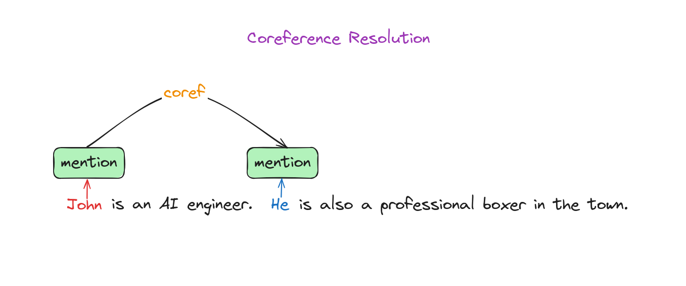
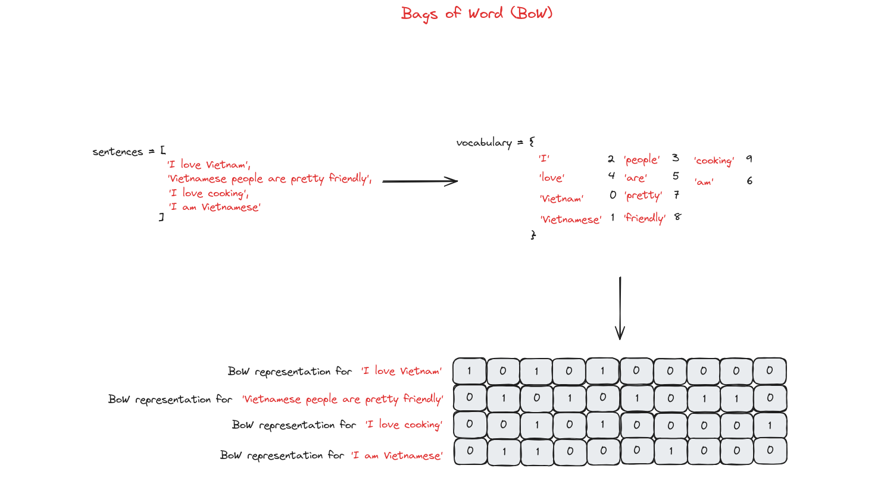
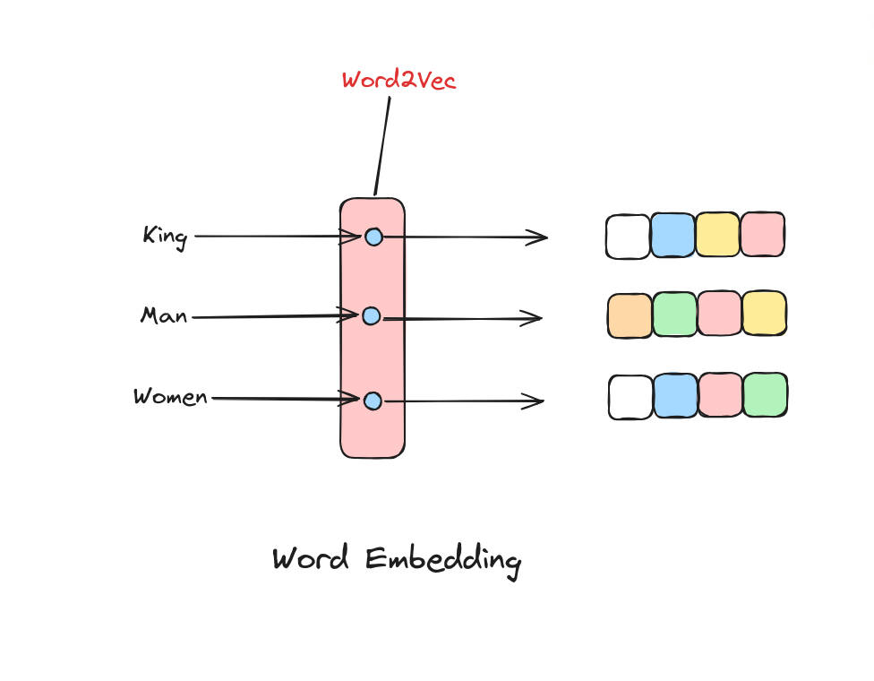

# Quy trình NLP (NLP Pipeline)
Chúng ta đã tìm hiểu một số ứng dụng phổ biến của NLP (Xử lý Ngôn ngữ Tự nhiên) như Phân tích cảm xúc (Sentiment Analysis), Trích xuất thông tin (Information Extraction), Tóm tắt văn bản (Text Summarization)... và bây giờ sẽ tìm hiểu cách xây dựng các ứng dụng này. Để xây dựng một ứng dụng như vậy trong tổ chức, chúng ta sẽ chia nhỏ vấn đề thành các bài toán con và phát triển quy trình từng bước, liệt kê tất cả các hình thức xử lý văn bản cần thiết. Quy trình này gọi là "pipeline" (chuỗi xử lý), bao gồm các bước cần thiết để xây dựng bất kỳ mô hình NLP nào. Hiểu rõ các bước này là điều quan trọng để giải quyết các bài toán NLP trong thực tế.

Hình trên mô tả các thành phần chính của một quy trình phát triển hệ thống NLP hiện đại dựa trên dữ liệu. Các giai đoạn chính trong pipeline này gồm:

1. Thu thập dữ liệu (Data acquisition)
2. Làm sạch văn bản (Text cleaning)
3. Tiền xử lý (Pre-processing)
4. Kỹ thuật đặc trưng (Feature engineering)
5. Xây dựng mô hình (Modeling)
6. Đánh giá (Evaluation)
7. Triển khai (Deployment)
8. Giám sát và cập nhật mô hình (Monitoring and Model Updating)

Việc phát triển một hệ thống NLP bắt đầu bằng việc thu thập dữ liệu phù hợp, sau đó là làm sạch và tiền xử lý để chuẩn hóa dữ liệu. Tiếp theo, kỹ thuật đặc trưng sẽ trích xuất các chỉ số hữu ích, được định dạng cho các thuật toán mô hình hóa. Trong giai đoạn xây dựng và đánh giá mô hình, các mô hình khác nhau được xây dựng và kiểm tra. Mô hình tốt nhất sẽ được triển khai, và hiệu suất của nó sẽ được giám sát, cập nhật thường xuyên khi cần thiết.

Trên thực tế, quy trình phát triển NLP không phải lúc nào cũng tuyến tính. Thường xuyên phải quay lại các bước như trích xuất đặc trưng, xây dựng mô hình và đánh giá nhiều lần. Có những vòng lặp, đặc biệt từ đánh giá quay lại tiền xử lý, kỹ thuật đặc trưng và mô hình hóa. Ở cấp độ dự án, còn có vòng lặp từ giám sát quay lại thu thập dữ liệu.

Chúng ta sẽ lần lượt tìm hiểu từng giai đoạn của pipeline NLP, bắt đầu với bước đầu tiên: thu thập dữ liệu.

## Thu thập dữ liệu (Data Acquisition)

Dữ liệu là yếu tố then chốt cho bất kỳ hệ thống học máy (machine learning) nào, và thường là điểm nghẽn trong các dự án công nghiệp. Ở phần này, chúng ta sẽ tìm hiểu các chiến lược thu thập dữ liệu phù hợp cho dự án NLP. Đôi khi dữ liệu đã sẵn có, nhưng nhiều lúc phải tự tìm kiếm. Dữ liệu văn bản có thể lấy từ nhiều nguồn như website, email, mạng xã hội, nhưng không phải lúc nào cũng ở định dạng máy có thể đọc được hoặc phù hợp với bài toán. Vì vậy, cần hiểu rõ vấn đề trước khi tìm kiếm dữ liệu. Một số phương pháp thu thập dữ liệu:

+ Bộ dữ liệu công khai (Public dataset): Có thể tìm kiếm các bộ dữ liệu công khai để sử dụng, nếu phù hợp thì xây dựng và đánh giá mô hình. Nếu không có bộ dữ liệu phù hợp, cần cân nhắc phương án khác.
+ Thu thập dữ liệu từ Internet (Scrape data): Có thể lấy dữ liệu liên quan từ Internet, sau đó dữ liệu này sẽ được gán nhãn bởi con người.
+ Tăng cường dữ liệu (Data augmentation): Việc thu thập dữ liệu hiệu quả nhưng tốn thời gian, do đó có thể sử dụng kỹ thuật tăng cường dữ liệu để tạo ra văn bản có cấu trúc tương tự dữ liệu gốc cho các bài toán NLP.

## Làm sạch văn bản (Text cleaning)
Đôi khi dữ liệu thu thập được không sạch, chứa các thẻ HTML, lỗi chính tả hoặc ký tự đặc biệt. Vì vậy, cần có các phương pháp để làm sạch dữ liệu văn bản.

+ Chuẩn hóa Unicode (Unicode Normalization): Khi làm việc với dữ liệu văn bản, có thể gặp các ký hiệu, emoji hoặc ký tự đặc biệt. Có thể chuyển chúng thành dạng văn bản mà máy tính hiểu được.
+ Phân tích và làm sạch HTML (HTML parsing and cleanup): Phân tích mã HTML để hiểu cấu trúc, sau đó loại bỏ các thành phần không cần thiết hoặc sai (như thẻ HTML) để đảm bảo mã sạch và đúng định dạng.
+ Kiểm tra chính tả (Spell checks): Thực hiện kiểm tra chính tả cơ bản để sửa các lỗi thường gặp và làm cho văn bản nhất quán.

Chúng ta chuyển sang bước tiếp theo trong pipeline: tiền xử lý.

## Tiền xử lý (Pre-processing)

Ngay cả sau khi đã làm sạch văn bản, chúng ta vẫn cần tiền xử lý, đặc biệt khi thu thập dữ liệu từ Internet. Ngoài ra, phần mềm NLP yêu cầu văn bản phải được tách thành câu và từ. Tiền xử lý bao gồm các nhiệm vụ này, cũng như loại bỏ ký tự đặc biệt, số, chuyển văn bản về chữ thường nếu cần. Các quyết định này được thực hiện trong giai đoạn tiền xử lý của NLP.

+ Bước khởi đầu (Initial steps):
    + Tách câu (Sentence segmentation): Quá trình chia văn bản thành các câu riêng biệt.
    + Tách từ (Word tokenization): Quá trình tách từng câu (đầu ra từ bước tách câu) thành các từ riêng biệt.

+ Bước thường gặp (Regular steps):
    + Loại bỏ từ dừng (Stop word removal): Loại bỏ các từ phổ biến, không mang nhiều ý nghĩa (như "và", "là", "của"...).
    + Loại bỏ số/ký tự đặc biệt (Removing digits/punctuation): Xóa các số và dấu câu khỏi văn bản.
    + Chuyển về chữ thường (Lowercasing): Chuyển tất cả ký tự về chữ thường.
    + Rút gọn từ (Stemming) và chuẩn hóa từ gốc (Lemmatization): Đưa từ về dạng gốc hoặc cơ bản.

+ Bước khác (Other steps):
    + Gán nhãn từ loại (POS tagging): Gán nhãn cho các từ trong văn bản theo loại từ (danh từ, động từ, tính từ...).

    + Giải quyết đồng tham chiếu (Coreference resolution): Xác định khi nào các từ khác nhau cùng chỉ về một thực thể trong văn bản.

    + Cây phân tích cú pháp (Parsing tree): Biểu diễn cấu trúc cú pháp của một chuỗi theo ngữ pháp, các nút là các thành phần và gốc là ký hiệu bắt đầu.

Tiếp theo, chúng ta sẽ chuyển sang bước kỹ thuật đặc trưng.

## Kỹ thuật đặc trưng (Feature Engineering)
Chúng ta đã thảo luận về các bước tiền xử lý và lợi ích của chúng. Để sử dụng văn bản đã tiền xử lý trong các mô hình học máy (ML), cần chuyển đổi văn bản thành các vector số mà thuật toán ML hiểu được. Quá trình này gọi là "biểu diễn văn bản" (text representation).

Có hai hướng tiếp cận chính trong kỹ thuật đặc trưng:

+ Kỹ thuật đặc trưng cho pipeline học máy truyền thống (traditional ML pipelines): Thường được thiết kế thủ công cho từng bài toán cụ thể. Ví dụ, trong phân tích cảm xúc đánh giá sản phẩm, có thể đếm số từ tích cực và tiêu cực để dự đoán cảm xúc. Đặc trưng được thiết kế dựa trên kiến thức bài toán và lĩnh vực, giúp mô hình dễ giải thích.

+ Kỹ thuật đặc trưng cho pipeline học sâu (deep learning pipelines): Sử dụng dữ liệu thô đã tiền xử lý và học đặc trưng từ dữ liệu, thường cho hiệu quả tốt hơn. Tuy nhiên, mô hình học sâu (DL) lại khó giải thích vì khó biết được lý do dự đoán. Ví dụ, trong phát hiện email rác, dễ xác định từ nào ảnh hưởng đến quyết định với đặc trưng thủ công, nhưng khó với mô hình DL.

Có nhiều kỹ thuật đặc trưng khác nhau, ví dụ:

+ Bag of Words (BoW - Túi từ): Phương pháp biểu diễn văn bản bằng cách chuyển thành tập hợp các từ, bỏ qua ngữ pháp và thứ tự, đếm tần suất xuất hiện của từng từ.

+ TF-IDF (Term Frequency-Inverse Document Frequency): Phương pháp đánh giá tầm quan trọng của một từ trong văn bản dựa trên tần suất xuất hiện trong văn bản và độ hiếm của nó trên toàn bộ tập tài liệu.

+ One-Hot Encoding: Phương pháp chuyển dữ liệu phân loại thành vector nhị phân, mỗi giá trị được biểu diễn bằng một vector chỉ có một vị trí là '1', các vị trí còn lại là '0'.

+ Word Embeddings (nhúng từ - Word2Vec, GloVe, FastText...): Kỹ thuật biểu diễn từ dưới dạng vector đặc, trong không gian liên tục, giúp nắm bắt quan hệ ngữ nghĩa giữa các từ dựa trên cách sử dụng trong tập văn bản lớn.

Tất cả các kỹ thuật này sẽ được trình bày chi tiết hơn trong bài **Word Embeddings**.

Tiếp theo, chúng ta sẽ tìm hiểu bước xây dựng mô hình (modeling).

## Xây dựng mô hình (Modeling)

Khi đã có dữ liệu dự án NLP và nắm được các bước làm sạch, tiền xử lý cần thiết, trọng tâm chuyển sang xây dựng giải pháp hiệu quả. Ban đầu, các phương pháp đơn giản và quy tắc là đủ, đặc biệt khi dữ liệu còn ít. Khi hiểu rõ hơn về bài toán và có thêm dữ liệu, có thể tăng dần độ phức tạp để cải thiện hiệu quả.

Khi bắt đầu dự án với dữ liệu hạn chế, có thể dùng phương pháp heuristic (kinh nghiệm), nhất là cho các nhiệm vụ thu thập dữ liệu cho mô hình ML/DL. Cách này thường dựa vào biểu thức chính quy (regular expressions) để thu thập và xử lý dữ liệu hiệu quả.

Sau đó, có thể sử dụng các mô hình học máy như Naive Bayes, Support Vector Machine (SVM), Hidden Markov Model (HMM), Conditional Random Fields (CRF) để giải quyết bài toán.

Cuối cùng, hiện nay mạng nơ-ron (neural network) ngày càng được sử dụng nhiều để xử lý dữ liệu phức tạp, không có cấu trúc như ngôn ngữ. Để giải quyết hiệu quả, cần các mô hình có khả năng biểu diễn và học tốt hơn. Một số mạng nơ-ron sâu (deep neural networks) tiêu biểu: Recurrent Neural Network (RNN), Long Short-Term Memory (LSTM), GRU, Attention, Transformer, BERT...

## Đánh giá (Evaluation)
Một bước quan trọng trong pipeline NLP là đánh giá hiệu quả của mô hình, thường được đo bằng hiệu suất trên dữ liệu chưa từng thấy. Các chỉ số đánh giá (evaluation metrics) thay đổi tùy theo nhiệm vụ NLP và giai đoạn dự án. Khi xây dựng và triển khai mô hình, dùng các chỉ số ML; khi vận hành thực tế, còn dùng thêm chỉ số kinh doanh để đo tác động.

Có hai loại đánh giá chính:
+ Đánh giá nội tại (Intrinsic evaluation): So sánh đầu ra mô hình với bộ kiểm thử có nhãn để đo độ khớp, ví dụ:
    + RMSE (root mean squared error - căn bậc hai trung bình bình phương sai số): Đo độ lớn trung bình của sai số dự đoán, dùng cho bài toán hồi quy như dự đoán nhiệt độ, giá cổ phiếu...
    + MAPE (Mean Absolute Percentage Error - sai số phần trăm tuyệt đối trung bình): Đo phần trăm sai số trung bình giữa giá trị dự đoán và thực tế, thể hiện độ chính xác của mô hình dự báo.
    + Accuracy (độ chính xác): Tỷ lệ dự đoán đúng trên tổng số dự đoán, dùng cho phân loại như phân loại cảm xúc, phát hiện email rác...
    + Precision (độ chính xác): Tỷ lệ dự đoán dương đúng trên tổng số dự đoán dương, dùng cho phân loại.
    + Recall (độ bao phủ): Tỷ lệ dự đoán dương đúng trên tổng số trường hợp dương thực tế, dùng cho phân loại.
    + F1 score: Kết hợp precision và recall thành một chỉ số duy nhất, là trung bình điều hòa của hai chỉ số này, dùng cho phân loại.
    + AUC (Area Under the Curve): Đo hiệu suất của mô hình phân loại nhị phân, thể hiện khả năng phân biệt giữa các lớp, thường dùng với đường cong ROC.
    + BLEU (Bilingual Evaluation Understudy): Đánh giá chất lượng văn bản dịch máy bằng cách so sánh với bản dịch tham chiếu, đo mức độ trùng khớp từ.
    + ROUGE (Recall-Oriented Understudy for Gisting Evaluation): Đánh giá tóm tắt văn bản bằng cách so với bản tóm tắt tham chiếu, tập trung vào mức độ trùng lặp n-gram, chuỗi từ, cặp từ.

+ Đánh giá ngoại tại (Extrinsic evaluation): Đo mục tiêu cuối cùng, ví dụ như thời gian người dùng phải xử lý email rác.

## Triển khai (Deployment)

Trong thực tế, hệ thống NLP thường được tích hợp vào các hệ thống lớn hơn, ví dụ bộ lọc email rác. Sau khi hoàn thành các bước xử lý, xây dựng mô hình và đánh giá, việc triển khai giải pháp cuối cùng là rất quan trọng. Điều này bao gồm tích hợp module NLP vào hệ thống lớn, đảm bảo khả năng mở rộng và tương thích với các pipeline đầu vào/ra trong môi trường sản xuất.

Module NLP thường được triển khai dưới dạng dịch vụ web (web service), nhận đầu vào là văn bản và trả về kết quả phân loại, ví dụ email rác hoặc không rác. Dịch vụ này xử lý email theo thời gian thực, hỗ trợ quyết định xử lý email. Với các tác vụ xử lý hàng loạt (batch processing), module NLP có thể tích hợp vào các hàng đợi tác vụ lớn hơn, như trên Google Cloud hoặc AWS.

## Giám sát và cập nhật mô hình (Monitoring and model updating)
### Giám sát (Monitoring)
Tương tự các dự án phần mềm khác, kiểm thử kỹ lưỡng là cần thiết trước khi triển khai bất kỳ mô hình NLP nào, và việc giám sát liên tục sau triển khai là rất quan trọng. Tuy nhiên, giám sát dự án NLP cần chú ý đặc biệt để đảm bảo đầu ra của mô hình luôn có ý nghĩa theo thời gian. Điều này bao gồm kiểm tra thường xuyên hành vi mô hình, nhất là khi mô hình được cập nhật huấn luyện liên tục. Có thể sử dụng dashboard theo dõi hiệu suất, hiển thị các tham số và chỉ số chính của mô hình.

### Cập nhật mô hình (Model Updating)
Khi mô hình đã triển khai và bắt đầu thu thập dữ liệu mới, chúng ta sẽ lặp lại việc huấn luyện mô hình dựa trên dữ liệu mới này để dự đoán luôn phù hợp.

## Kết luận

Trong bài học này, chúng ta đã tìm hiểu quy trình xử lý ngôn ngữ tự nhiên (NLP pipeline), từ thu thập dữ liệu đến giám sát và cập nhật mô hình. Hiểu rõ pipeline này là điều kiện tiên quyết để xây dựng các ứng dụng NLP hiệu quả.

## Tài liệu tham khảo

+ Sowmya Vajjala, Bodhisattwa Majumder, Anuj Gupta, and Harshit Surana, Practical natural language processing : a comprehensive guide to building real-world NLP sysems. Sebastopol, Ca O’reilly Media, 2020.
+ “Natural Language Processing (NLP) Pipeline,” GeeksforGeeks, Jun. 01, 2023. https://www.geeksforgeeks.org/natural-language-processing-nlp-pipeline/
+ “Behind the pipeline - Hugging Face NLP Course,” huggingface.co. https://huggingface.co/learn/nlp-course/en/chapter2/2 (accessed Jul. 07, 2024).