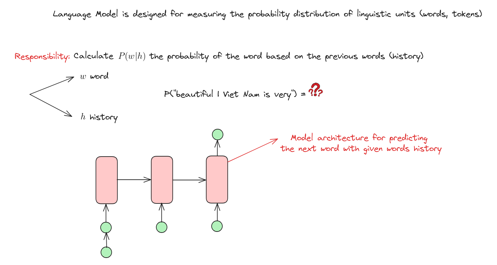
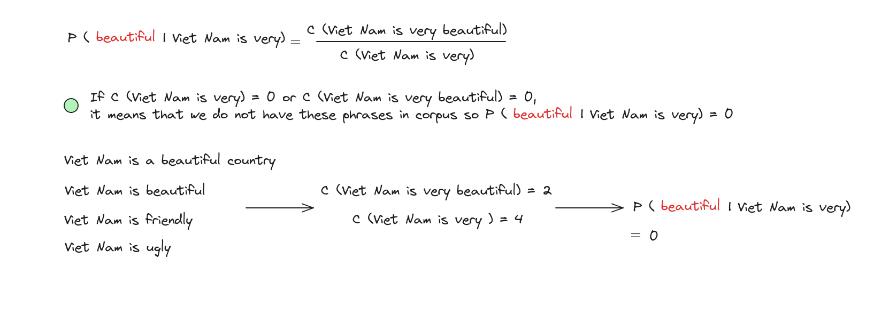
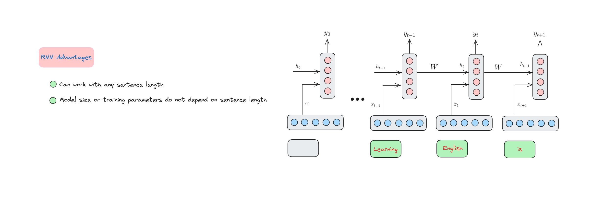

# Recurrent Neural Network

## Introduction

A Recurrent Neural Network (RNN) is a type of neural network designed to process sequences of data, such as time series, language, or video frames. Unlike traditional neural networks, RNNs have connections that loop back on themselves, allowing them to maintain a "memory" of previous inputs. This makes RNNs ideal for tasks like language modeling, speech recognition, and sequence prediction. 

Variants like Long Short-Term Memory (LSTM) and Gated Recurrent Unit (GRU) have been developed to address challenges in training RNNs, particularly for capturing long-term dependencies in data. We will discuss these variants in another lesson.

## Language Models
A language model is a type of artificial intelligence system designed to understand, generate, or predict human language based on patterns and structures it learns from vast amounts of text data. It's like a virtual linguist that processes and generates text, aiding in tasks such as translation, summarization, and conversation.


## N-Grams Language Models
### N-Grams


### N-Grams Models


### N-Grams Problem


### N-Grams Solution


### N-Grams Weakness


We need a new language model can solve these problems.

## Neural Language Models
A neural language model is a type of language model that uses artificial neural networks, inspired by the human brain's structure, to process and generate human language. By training on large datasets, it learns patterns and relationships in language, enabling tasks such as text generation, translation, and sentiment analysis with high accuracy.

### Recurrent Neural Network Components


### RNN-based Language Model


### RNN Inference Progress


### RNN Advantages


### RNN Problems and Solution


## Implement RNN model
In this session, we will build an RNN model to generate text.

### Download dataset
```python
!wget https://raw.githubusercontent.com/dunghoang369/data/master/data.txt
```

### Import necessary libraries
```python
import numpy as np
import tensorflow.keras.utils as ku
from tensorflow.keras import regularizers
from tensorflow.keras.optimizers import Adam
from tensorflow.keras.models import Sequential
from tensorflow.keras.preprocessing.text import Tokenizer
from tensorflow.keras.preprocessing.sequence import pad_sequences
from tensorflow.keras.layers import Embedding, SimpleRNN, Dense, Dropout, Bidirectional
```

### Load data
```python
data = open('data.txt').read()
corpus = data.lower().split("\n")

# Show some sentences in the corpus
print(corpus[:4])

['from fairest creatures we desire increase,',
 "that thereby beauty's rose might never die,",
 'but as the riper should by time decease,',
 'his tender heir might bear his memory:']
```

### Build tokenizer
```python
tokenizer = Tokenizer()
tokenizer.fit_on_texts(corpus)

# Count number of words in the vocabulary
total_words = len(tokenizer.word_index) + 1 # 1 for oov (out-of-vocabulary) token

Total words:  3211
```

### Preprocess data
We will split each sentence into smaller parts that have sentence length is ascending to make each data point. 
```python
input_sequences = []
for line in corpus:
  token_list = tokenizer.texts_to_sequences([line])[0]
  for i in range(1, len(token_list)):
    n_gram_sequence = token_list[:i+1]
    input_sequences.append(n_gram_sequence)
```

The data now will be look like that
```python
for point in input_sequences[:10]:
  print(" ".join(tokenizer.sequences_to_texts([point])))

from fairest
from fairest creatures
from fairest creatures we
from fairest creatures we desire
from fairest creatures we desire increase
that thereby
that thereby beauty's
that thereby beauty's rose
that thereby beauty's rose might
that thereby beauty's rose might never
``` 

### Padding whole dataset
```
# pad sequences
max_sequence_len = max([len(x) for x in input_sequences])
input_sequences = np.array(pad_sequences(input_sequences, maxlen=max_sequence_len, padding='pre'))
```
We will pad 0 to the front of above **input_sequences** to create the same length sentences. We add 0 to the front because in this problem we will generate words from the back, so the information on the right must be non-zero values.

### Split sequence into features and label
```python
features, label = input_sequences[:,:-1],input_sequences[:,-1]
for i in range(10):
  print("{} ---> {}".format(" ".join(tokenizer.sequences_to_texts(features[i:i+1])), tokenizer.sequences_to_texts([label[i:i+1]])[0]))

from ---> fairest
from fairest ---> creatures
from fairest creatures ---> we
from fairest creatures we ---> desire
from fairest creatures we desire ---> increase
that ---> thereby
that thereby ---> beauty's
that thereby beauty's ---> rose
that thereby beauty's rose ---> might
that thereby beauty's rose might ---> never
```

### Convert labels to one hot vectors
We will convert each label to one hot vector that has length is the total words in the vocabulary.
```python
label = ku.to_categorical(label, num_classes=total_words)
```

### Build RNN model
```python
model = Sequential()
model.add(Embedding(total_words, 100, input_length=max_sequence_len-1))
model.add(Bidirectional(SimpleRNN(150, return_sequences = True)))
model.add(Dropout(0.2))
model.add(SimpleRNN(100)) # h
model.add(Dense(total_words/2, activation='relu', kernel_regularizer=regularizers.l2(0.01)))
model.add(Dense(total_words, activation='softmax'))
model.compile(loss='categorical_crossentropy', optimizer='adam', metrics=['accuracy'])
print(model.summary())

Model: "sequential_4"
_________________________________________________________________
 Layer (type)                Output Shape              Param #   
=================================================================
 embedding_4 (Embedding)     (None, 10, 100)           321100    
                                                                 
 bidirectional_2 (Bidirecti  (None, 10, 300)           75300     
 onal)                                                           
                                                                 
 dropout_2 (Dropout)         (None, 10, 300)           0         
                                                                 
 simple_rnn_3 (SimpleRNN)    (None, 100)               40100     
                                                                 
 dense_4 (Dense)             (None, 1605)              162105    
                                                                 
 dense_5 (Dense)             (None, 3211)              5156866   
                                                                 
=================================================================
Total params: 5755471 (21.96 MB)
Trainable params: 5755471 (21.96 MB)
Non-trainable params: 0 (0.00 Byte)
_________________________________________________________________
None
```

### Traning RNN model
```python
history = model.fit(features, label, epochs=130, verbose=1)
```

### Predict 10 next words
```python
test_seq = "despite of wrinkles this thy golden time more survey slain torn slain erred"
next_words = 10

for _ in range(next_words):
  # Chuyển câu thành vector
  token_list = tokenizer.texts_to_sequences([test_seq])[0]

  # Padding câu
  token_list = pad_sequences([token_list], maxlen=max_sequence_len-1, padding='pre')

  # Dự đoán từ tiếp theo
  predicted = model.predict(token_list, verbose=0)

  output_word = ""

  predicted_id = np.argmax(predicted)

  if predicted_id in tokenizer.index_word:
    output_word = tokenizer.index_word[predicted_id]
    test_seq += " " + output_word
  else:
    break

print(test_seq)
```

Here is the output:

```python
despite of wrinkles this thy golden time more survey slain torn slain erred cross hate part new quite stand it words more words
```

## Conclusion

In this lesson, we have discussed:

+ N-Grams Language Models.
+ The magic of Recurrent Neural Networks (RNNs) and their ability to handle sequential data like text and speech. We explored how RNNs remember past inputs, making them perfect for tasks requiring context.
+ The advantages and disadvantages of RNNs.

## References

+ A. Amidi and S. Amidi, “CS 230 - Recurrent Neural Networks Cheatsheet,” Stanford.edu, 2019. https://stanford.edu/~shervine/teaching/cs-230/cheatsheet-recurrent-neural-networks
+ “Recurrent Neural Network Tutorial (RNN),” www.datacamp.com. https://www.datacamp.com/tutorial/tutorial-for-recurrent-neural-network