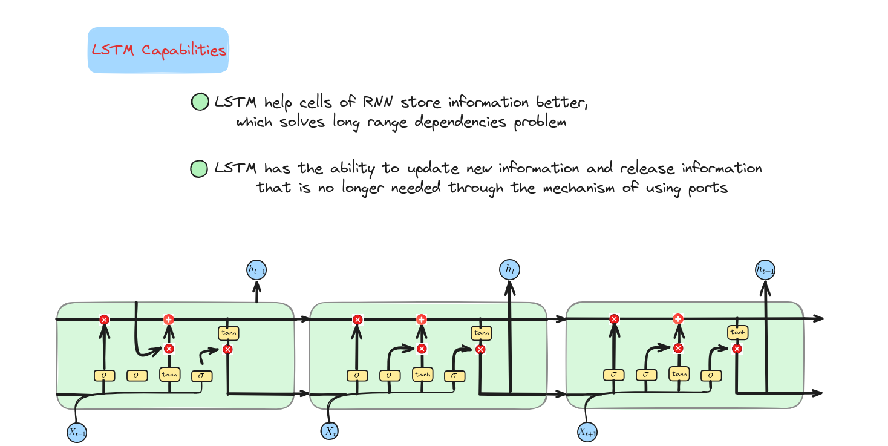
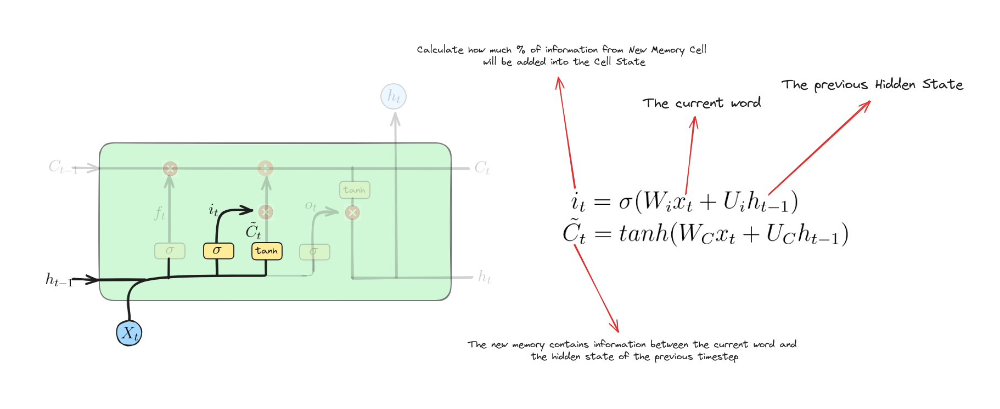
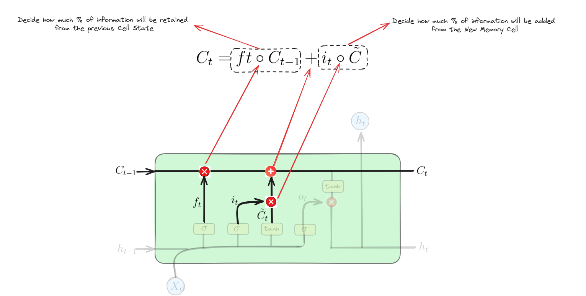
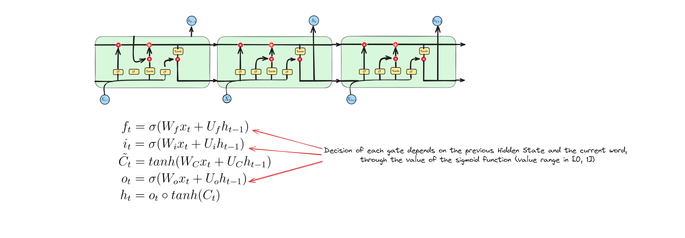
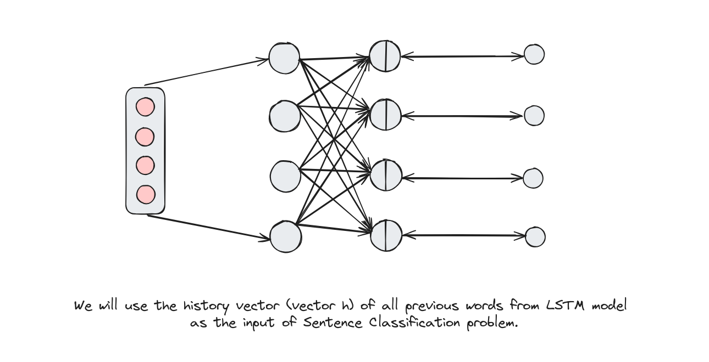

# Long Short Term Memory (LSTM - Bộ nhớ ngắn dài hạn)


## Giới thiệu (Introduction)

Long Short-Term Memory (LSTM) là một mạng nơ-ron hồi tiếp (Recurrent Neural Network - RNN) được cải tiến để xử lý hiệu quả các phụ thuộc dài hạn (long-term dependencies) nhờ cơ chế cổng (gate mechanism). Điều này giúp LSTM lý tưởng cho các bài toán như dịch ngôn ngữ, nhận diện giọng nói, dự đoán chuỗi thời gian... Hãy cùng tìm hiểu cách hoạt động của mạng mạnh mẽ này!


## LSTM là gì? (What is Long Short Term Memory?)
Như đã đề cập trong bài **Recurrent Neural Network**, các vấn đề **phụ thuộc dài hạn** (long range dependencies) và **tiêu biến gradient** (Gradient Vanishing) rất phổ biến khi huấn luyện RNN. Sự xuất hiện của **Long Short Term Memory** là vị cứu tinh.

LSTM là một loại mạng nơ-ron hồi tiếp (RNN) được thiết kế để khắc phục hạn chế của RNN truyền thống khi xử lý dữ liệu tuần tự. LSTM sử dụng một ô nhớ (memory cell) có thể lưu trữ thông tin trong thời gian dài, cho phép ghi nhớ ngữ cảnh quan trọng ngay cả khi chuỗi đầu vào rất dài. LSTM đạt được điều này nhờ một loạt các cổng chuyên biệt (specialized gates) kiểm soát luồng thông tin vào/ra ô nhớ, giúp học và lưu giữ các mẫu tuần tự hiệu quả.


## Tại sao cần dùng LSTM? (Why we need to use Long Short Term Memory?)



## Kiến trúc của LSTM (Long Short Term Memory Architecture)


## LSTM hoạt động như thế nào? (How Long Short Term Memory works?)
### Cổng quên (Forget Gate)


Phương trình này biểu diễn cổng quên trong LSTM. Nó tính toán giá trị kích hoạt của cổng quên bằng cách kết hợp đầu vào hiện tại $x_{t}$ và trạng thái ẩn trước đó $h_{t-1}$, sau đó áp dụng hàm sigmoid để kiểm soát lượng thông tin cần quên từ trạng thái ô nhớ trước đó.

### Cổng vào (Input Gate)


Các phương trình này biểu diễn cổng vào và trạng thái ô nhớ ứng viên trong LSTM:
+ Cổng vào: Tính toán giá trị kích hoạt của cổng vào bằng cách kết hợp $x_{t}$ và $h_{t-1}$, áp dụng hàm sigmoid để kiểm soát lượng thông tin mới được đưa vào ô nhớ.
+ Trạng thái ô nhớ ứng viên: Tính toán trạng thái ô nhớ ứng viên bằng cách kết hợp $x_{t}$ và $h_{t-1}$, áp dụng hàm $tanh$ để sinh thông tin mới cần thêm vào ô nhớ.

### Cập nhật trạng thái (Update Operation)


Phương trình này cập nhật trạng thái ô nhớ $C_{t}$ bằng cách kết hợp:
+ Trạng thái ô nhớ trước $C_{t-1}$ nhân với cổng quên $f_{t}$ (quyết định giữ lại bao nhiêu thông tin cũ).
+ Trạng thái ô nhớ ứng viên $\tilde{C}_{t}$ nhân với cổng vào $i_{t}$ (quyết định thêm bao nhiêu thông tin mới).

### Cổng ra (Output Gate)


Các phương trình này biểu diễn cổng ra và trạng thái ẩn trong LSTM:
+ Cổng ra: Tính toán giá trị kích hoạt của cổng ra bằng cách kết hợp $x_{t}$ và $h_{t-1}$, áp dụng hàm sigmoid để kiểm soát đầu ra từ ô nhớ.
+ Trạng thái ẩn: Xác định trạng thái ẩn $h_{t}$ bằng cách áp dụng hàm $tanh$ lên $C_{t}$ để tạo ứng viên đầu ra, sau đó nhân với giá trị kích hoạt của cổng ra $o_{t}$. Điều này quyết định phần nào của ô nhớ sẽ được truyền sang bước tiếp theo và làm đầu ra tại thời điểm hiện tại.

### Quyết định cuối cùng (Make a decision)


### Phân loại câu (Sentence Classification)



## Triển khai mô hình LSTM (Implement LSTM Model)
Trong phần này, chúng ta sẽ xây dựng một mô hình LSTM để phát hiện châm biếm (Sarcasm Detection). Bài lab này được thực hiện trên **Google Colab**.

### Download dataset

Chúng ta sẽ sử dụng **News Headlines Dataset** cho dự án này. Bộ dữ liệu này được thu thập từ hai trang tin [TheOnion](https://www.theonion.com/) và [HuffPost](https://www.huffpost.com/).
Mỗi bản ghi gồm 3 thuộc tính:
- **is_sarcastic**: 1 nếu là châm biếm, 0 nếu không
- **headline**: tiêu đề bài báo
- **article_link**: liên kết đến bài báo gốc (hữu ích để thu thập thêm dữ liệu)

```python
!wget https://raw.githubusercontent.com/dunghoang369/data/master/Sarcasm_Headlines_Dataset.json
```


### Import các thư viện cần thiết (Import necessary libraries)
```python
import json
import numpy as np
import pandas as pd
import tensorflow as tf
import tensorflow_datasets as tfds
from tensorflow.keras.models import Sequential
from sklearn.metrics import classification_reportEach record consists of three attributes:
from tensorflow.keras.layers import Embedding, RNN, Dense, LSTM, Bidirectional
```

### Tải dữ liệu (Load dataset)
```python
df = pd.read_json("Sarcasm_Headlines_Dataset.json", lines=True)
datastore = df.to_json()
datastore = json.loads(datastore)
```

### Tách đặc trưng (Split features)
```python
article_link_datastore = datastore["article_link"]
headline_datastore = datastore["headline"]
sarcastic_datastore = datastore["is_sarcastic"]

sentences = []
urls = []
labels = []
table = str.maketrans('', '', string.punctuation)
for key in article_link_datastore:
    sentences.append(headline_datastore[key].lower())
    urls.append(article_link_datastore[key])
    labels.append(sarcastic_datastore[key])


# In ra một số mẫu dữ liệu
print("Sample 1: ", sentences[0], urls[0], labels[0])
print("Sample 2: ", sentences[1], urls[1], labels[1])

Sample 1: former versace store clerk sues over secret 'black code' for minority shoppers, https://www.huffingtonpost.com/entry/versace-black-code_us_5861fbefe4b0de3a08f600d5, 0
Sample 2: the 'roseanne' revival catches up to our thorny political mood, for better and worse, https://www.huffingtonpost.com/entry/roseanne-revival-review_us_5ab3a497e4b054d118e04365, 0
```

### Định nghĩa các siêu tham số (Define some hyperparameters)
```python
vocab_size = 1000
embedding_dim = 16
max_length = 120
trunc_type='post'
padding_type='post'
oov_tok = "<OOV>"
training_size = 20000
```

### Chia tập train, test (Split train, test datasets)
```python
training_sentences = np.array(sentences[:training_size])
training_labels = np.array(labels[:training_size])
test_sentences = np.array(sentences[training_size:])
test_labels = np.array(labels[training_size:])
```

### Xây dựng tokenizer (Build tokenizer)
```python
tokenizer = tf.keras.preprocessing.text.Tokenizer(vocab_size, oov_token=oov_tok)
tokenizer.fit_on_texts(training_sentences)
training_sequences = tokenizer.texts_to_sequences(training_sentences)
test_sequences = tokenizer.texts_to_sequences(test_sentences)
```

### Padding toàn bộ tập dữ liệu (Padding whole dataset)
```python
training_padded = tf.keras.preprocessing.sequence.pad_sequences(training_sequences, maxlen=max_length, padding='post', truncating='post')
test_padded = tf.keras.preprocessing.sequence.pad_sequences(test_sequences, maxlen=max_length, padding='post', truncating='post')
```

Chúng ta sẽ thêm số 0 vào cuối mỗi chuỗi trong **train_dataset** và **test_dataset** để tạo các chuỗi có cùng độ dài trong một batch.

### Xây dựng mô hình LSTM hai chiều (Build Bidirectional LSTM)
```python
model = tf.keras.models.Sequential()
model.add(tf.keras.layers.Embedding(vocab_size, embedding_dim, input_length=120))
model.add(Bidirectional(LSTM(32)))
model.add(tf.keras.layers.Dense(24, activation='relu'))
model.add(tf.keras.layers.Dense(1, activation='sigmoid'))
print(model.summary())

Model: "sequential"
_________________________________________________________________
 Layer (type)                Output Shape              Param #   
=================================================================
 embedding (Embedding)       (None, 120, 16)           16000     
                                                                 
 bidirectional (Bidirection  (None, 64)                12544     
 al)                                                             
                                                                 
 dense (Dense)               (None, 24)                1560      
                                                                 
 dense_1 (Dense)             (None, 1)                 25        
                                                                 
=================================================================
Total params: 30129 (117.69 KB)
Trainable params: 30129 (117.69 KB)
Non-trainable params: 0 (0.00 Byte)
_________________________________________________________________
```


### Huấn luyện mô hình (Train the model)
```python
# Set up callbacks
checkpoint = tf.keras.callbacks.ModelCheckpoint('best.h5',
                                                save_best_only=True,
                                                mode='min')
callbacks = [checkpoint]

# Set up optimizer, loss function and metrics
model.compile(optimizer=tf.keras.optimizers.Adam(),
              loss='binary_crossentropy',
              metrics=['accuracy'])

# Train the model
model.fit(training_padded, training_labels, batch_size=32, epochs=50, callbacks=callbacks, validation_data=(test_padded, test_labels))
```

### Đánh giá mô hình (Evaluate the model)
```python
predictions = model.predict(test_padded)
predictions = np.array([1 if prediction[0] > 0.5 else 0 for prediction in predictions])
print(classification_report(test_labels, predictions))

210/210 [==============================] - 2s 8ms/step
              precision    recall  f1-score   support

           0       0.82      0.83      0.83      3779
           1       0.78      0.76      0.77      2930

    accuracy                           0.80      6709
   macro avg       0.80      0.80      0.80      6709
weighted avg       0.80      0.80      0.80      6709
```
### Suy luận (Inference)
```python
def inference(text):
  text = np.array([text])
  sequences = tokenizer.texts_to_sequences(text)
  padded = tf.keras.preprocessing.sequence.pad_sequences(sequences, maxlen=max_length, padding='post', truncating='post')
  predict = model.predict(padded)
  if predict > 0.5:
    label = 1
  else: 
    label = 0
  print(f"Label: {['Sarcastic', 'Normal'][label]}")

1/1 [==============================] - 0s 20ms/step
Label: Sarcastic
```


## Kết luận (Conclusion)

Tóm lại, bài học hôm nay về Long Short-Term Memory (LSTM) đã giúp bạn hiểu sâu về cấu trúc và chức năng của nó. Chúng ta đã khám phá cách LSTM sử dụng các cổng—quên, vào, ra—để quản lý hiệu quả các phụ thuộc dài hạn và khắc phục hạn chế của RNN truyền thống.

## Tài liệu tham khảo (References)

+ C. Olah, “Understanding LSTM Networks,” Github.io, Aug. 27, 2015. https://colah.github.io/posts/2015-08-Understanding-LSTMs/
+ M. Phi, “Illustrated Guide to LSTM’s and GRU’s: A step by step explanation,” Medium, Jul. 10, 2019. https://towardsdatascience.com/illustrated-guide-to-lstms-and-gru-s-a-step-by-step-explanation-44e9eb85bf21