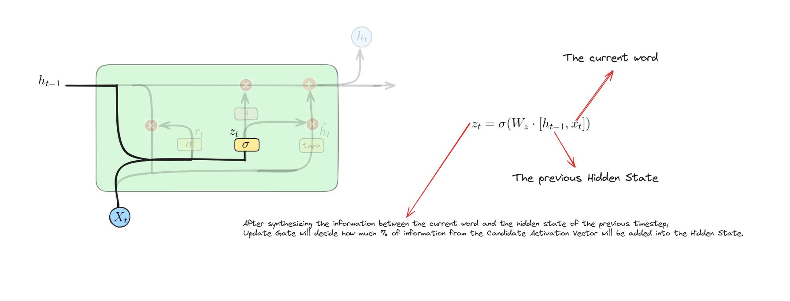
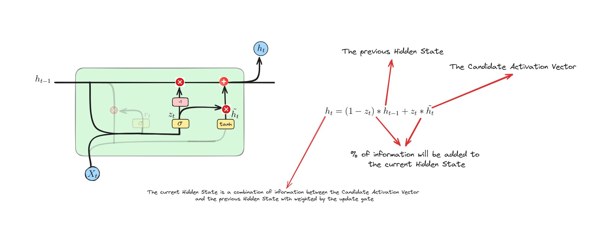

# Gated Recurrent Unit

## Introduction

Gated Recurrent Units (GRUs) are a simplified and efficient variant of Long Short-Term Memory (LSTM) networks. They use fewer gates and parameters, making them faster and easier to train while still effectively managing long-term dependencies in sequential data. 

We'll explore the architecture of GRUs, understand how they work, and see their applications in tasks like language modeling and time series prediction. Let's dive in.

## What is Gated Recurrent Unit? 
Gated Recurrent Unit (GRU) is a type of recurrent neural network (RNN) architecture. It has a similar mechanism to Long Short Term Memory but has fewer parameters and does not use Cell State. GRU is designed to address the vanishing gradient problem, which can occur in traditional RNNs.

Similar to LSTM, GRU utilizes gating mechanisms to selectively update and forget information over time, allowing it to retain important information over long sequences while efficiently handling short-term dependencies. In simpler terms, it's like a smart memory system in a network that decides what to remember and what to forget as it processes sequential data.

## Gated Recurrent Unit Architecture


## How Gated Recurrent Unit works?
### Reset Gate


This equation calculates the reset gate's activation by combining the previous hidden state and the current input, and then applying the sigmoid function to determine the extent to which the past information should be reset or forgotten.

### Update Gate


This equation calculates the update gate's activation by combining the previous hidden state and the current input, and then applying the sigmoid function to determine how much of the previous state should be retained and how much new information should be added.

### Candidate Activation Vector


This equation calculates the candidate hidden state by first scaling the previous hidden state $h_{t-1}$ with the reset gate $r_{t}$. This allows the model to forget parts of the previous state as needed. The scaled hidden state and the current input $x_{t}$ are then concatenated and passed through the weight matrix $W$ and the $tanh$ activation function to produce the candidate hidden state $\tilde{h}_{t}$.

### Update Operation


The equation blends the old hidden state $h_{t-1}$ with the new candidate $\tilde{h}_{t}$ based on the update gate $z_{t}$. If $z_{t}$ is close to 1, the new state $h_{t}$ mostly uses the candidate $\tilde{h}_{t}$. If $z_{t}$ is close to 0, it keeps more of the old state $h_{t-1}$.

### Make a decision


## Implement GRU Model
In this session, we will build a GRU model for Sarcasm Detection to compare with the LSTM model on the previous lesson. This lab was implemented on **Google Colab**.

### Download dataset
We will use **News Headlines Dataset** for this project. This dataset is collected from two news website are [TheOnion](https://www.theonion.com/) and [HuffPost](https://www.huffpost.com/).
Each record of the dataset consists of three attributes:
- **is_sarcastic**: 1 if the record is sarcastic otherwise 0
- **headline**: the headline of the news article
- **article_link**: link to the original news article. Useful in collecting supplementary data

```python
!wget https://raw.githubusercontent.com/dunghoang369/data/master/Sarcasm_Headlines_Dataset.json
```


### Import necessary libraries
```python
import json
import numpy as np
import pandas as pd
import tensorflow as tf
import tensorflow_datasets as tfds
from tensorflow.keras.models import Sequential
from sklearn.metrics import classification_reportEach record consists of three attributes:
from tensorflow.keras.layers import Embedding, Dense, GRU, Bidirectional
```

### Load dataset
```python
df = pd.read_json("Sarcasm_Headlines_Dataset.json", lines=True)
datastore = df.to_json()
datastore = json.loads(datastore)
```

### Split features
```python
article_link_datastore = datastore["article_link"]
headline_datastore = datastore["headline"]
sarcastic_datastore = datastore["is_sarcastic"]

sentences = []
urls = []
labels = []
table = str.maketrans('', '', string.punctuation)
for key in article_link_datastore:
    sentences.append(headline_datastore[key].lower())
    urls.append(article_link_datastore[key])
    labels.append(sarcastic_datastore[key])

# Print some samples
print("Sample 1: ", sentences[0], urls[0], labels[0])
print("Sample 2: ", sentences[1], urls[1], labels[1])

Sample 1: former versace store clerk sues over secret 'black code' for minority shoppers, https://www.huffingtonpost.com/entry/versace-black-code_us_5861fbefe4b0de3a08f600d5, 0
Sample 2: the 'roseanne' revival catches up to our thorny political mood, for better and worse, https://www.huffingtonpost.com/entry/roseanne-revival-review_us_5ab3a497e4b054d118e04365, 0
```

### Define some hyperparameters
```python
vocab_size = 1000
embedding_dim = 16
max_length = 120
trunc_type='post'
padding_type='post'
oov_tok = "<OOV>"
training_size = 20000
```

### Split train, test datasets
```python
training_sentences = np.array(sentences[:training_size])
training_labels = np.array(labels[:training_size])
test_sentences = np.array(sentences[training_size:])
test_labels = np.array(labels[training_size:])
```

### Build tokenizer
```python
tokenizer = tf.keras.preprocessing.text.Tokenizer(vocab_size, oov_token=oov_tok)
tokenizer.fit_on_texts(training_sentences)
training_sequences = tokenizer.texts_to_sequences(training_sentences)
test_sequences = tokenizer.texts_to_sequences(test_sentences)
```

### Padding whole dataset
```python
training_padded = tf.keras.preprocessing.sequence.pad_sequences(training_sequences, maxlen=max_length, padding='post', truncating='post')
test_padded = tf.keras.preprocessing.sequence.pad_sequences(test_sequences, maxlen=max_length, padding='post', truncating='post')
```
We will pad 0 to the back of each sequence in **train_dataset** and **test_dataset** to create the same length senquences in one batch.

### Build Bidirectional GRU
```python
model = tf.keras.models.Sequential()
model.add(tf.keras.layers.Embedding(vocab_size, embedding_dim, input_length=120))
model.add(Bidirectional(GRU(32)))
model.add(tf.keras.layers.Dense(24, activation='relu'))
model.add(tf.keras.layers.Dense(1, activation='sigmoid'))
print(model.summary())

Model: "sequential"
_________________________________________________________________
 Layer (type)                Output Shape              Param #   
=================================================================
 embedding (Embedding)       (None, 120, 16)           16000     
                                                                 
 bidirectional (Bidirection  (None, 64)                9600      
 al)                                                             
                                                                 
 dense (Dense)               (None, 24)                1560      
                                                                 
 dense_1 (Dense)             (None, 1)                 25        
                                                                 
=================================================================
Total params: 27185 (106.19 KB)
Trainable params: 27185 (106.19 KB)
Non-trainable params: 0 (0.00 Byte)
_________________________________________________________________
```
Compared with the LSTM model, the GRU model has fewer trainable parameters so it will be trained faster.


### Train the model
```python
# Set up callbacks
checkpoint = tf.keras.callbacks.ModelCheckpoint('best.h5',
                                                save_best_only=True,
                                                mode='min')
callbacks = [checkpoint]

# Set up optimizer, loss function and metrics
model.compile(optimizer=tf.keras.optimizers.Adam(),
              loss='binary_crossentropy',
              metrics=['accuracy'])

# Train the model
model.fit(training_padded, training_labels, batch_size=32, epochs=50, callbacks=callbacks, validation_data=(test_padded, test_labels))
```

### Evaluate the model
```python
predictions = model.predict(test_padded)
predictions = np.array([1 if prediction[0] > 0.5 else 0 for prediction in predictions])
print(classification_report(test_labels, predictions))

210/210 [==============================] - 2s 7ms/step
              precision    recall  f1-score   support

           0       0.83      0.80      0.81      3779
           1       0.75      0.78      0.77      2930

    accuracy                           0.79      6709
   macro avg       0.79      0.79      0.79      6709
weighted avg       0.79      0.79      0.79      6709
```
### Inference
```python
def inference(text):
  text = np.array([text])
  sequences = tokenizer.texts_to_sequences(text)
  padded = tf.keras.preprocessing.sequence.pad_sequences(sequences, maxlen=max_length, padding='post', truncating='post')
  predict = model.predict(padded)
  if predict > 0.5:
    label = 1
  else: 
    label = 0
  print(f"Label: {['Sarcastic', 'Normal'][label]}")

1/1 [==============================] - 0s 20ms/step
Label: Sarcastic
```

### Conclusion
Base on the evaluation, we can conclude that the LSTM model is a bit better than the GRU model but the LSTM model size is larger and the training progress take more time. This is the tradeoff between 2 models.

## Conclusion

In conclusion, the lesson on Gated Recurrent Units (GRUs) has demonstrated how these networks handle long-term dependencies in data. We learned about the reset and update gates, and how they help blend old and new information to update the hidden state efficiently. 

GRUs are simpler and faster to train compared to LSTMs, making them a great choice for many sequence-based tasks.

## References

+ M. Phi, “Illustrated Guide to LSTM’s and GRU’s: A step by step explanation,” Medium, Jul. 10, 2019. https://towardsdatascience.com/illustrated-guide-to-lstms-and-gru-s-a-step-by-step-explanation-44e9eb85bf21
+ Anishnama, “Understanding Gated Recurrent Unit (GRU) in Deep Learning,” Medium, May 04, 2023. https://medium.com/@anishnama20/understanding-gated-recurrent-unit-gru-in-deep-learning-2e54923f3e2