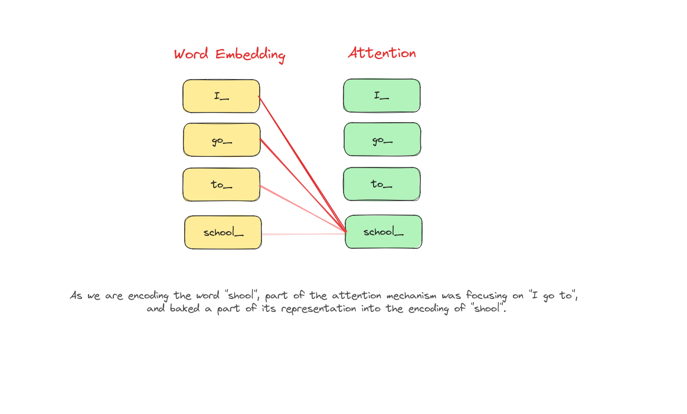
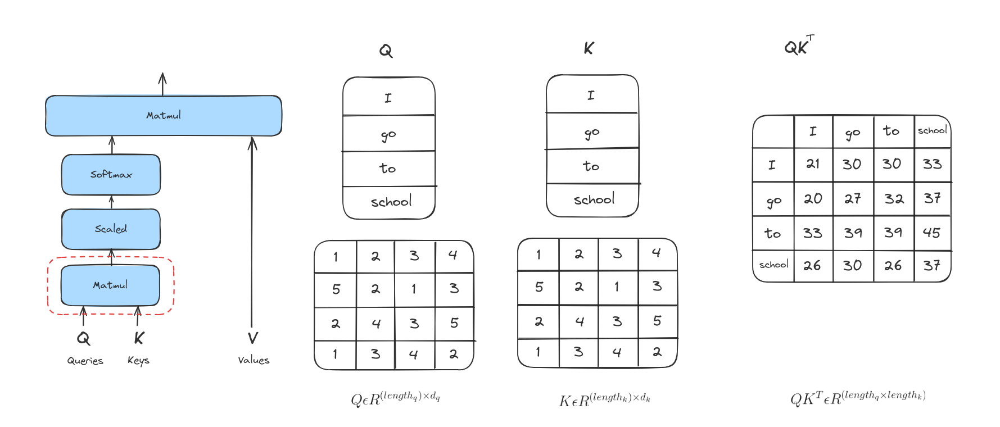
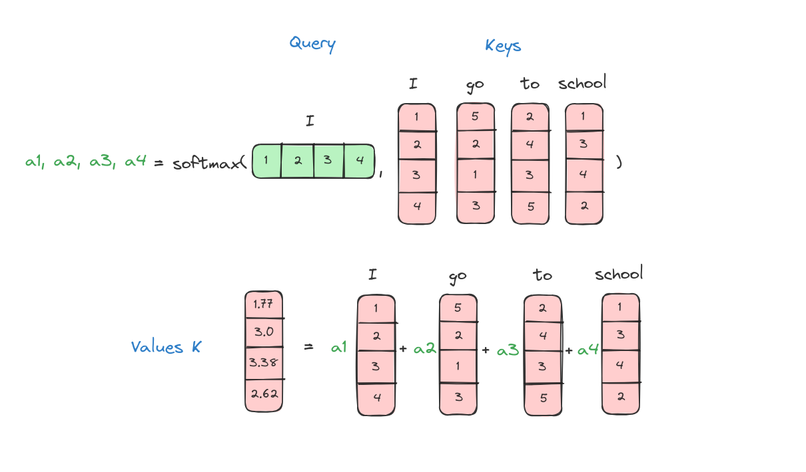

# Attention is all you need

## Introduction

The title also refers to a renowned paper that marks a significant advancement in the NLP domain. The introduction of Attention not only enhances word embedding but also addresses the constraints of CBOW and Skip Gram.

## What is Attention?

Attention is a mechanism in machine learning that allows models to focus on specific parts of input data while processing it. It helps the model assign different weights to different parts of the input, allowing it to prioritize relevant information and ignore irrelevant details. This enables the model to make more accurate predictions or generate more meaningful outputs. 

In natural language processing (NLP), attention mechanisms have been particularly useful for tasks like machine translation, text summarization, and sentiment analysis.



## How Attention works
### Information Retrieval
Attention's work mechanism is similar to information retrieval, so we will discuss about Information Retrieval first.


The boy in the picture wants to search for videos related to AI so he sends his requests to YouTube and YouTube converts his requests with AI to 1 and Leetcode to 0. Then YouTube searches all videos on YouTube and gets only AI videos to respond for him. 

### Attention workflow
#### First step
The first step in calculating attention is to create three vectors from each of the encoder’s input vectors. So for each word, we create a Query vector, a Key vector, and a Value vector. In this case, we assume that Query, Key and Value vector are the same.


#### Second step
The second step in calculating attention is to calculate a score. Say we’re calculating the attention for the first word in this example, “I”. We need to score each word of the input sentence against this word. The score determines how much focus to place on other parts of the input sentence as we encode a word at a certain position.

The score is calculated by taking the dot product of the query vector with the key vector of the respective word we’re scoring. So if we’re processing the attention for the word in the first position, the first score would be the dot product of q1 and k1. The second score would be the dot product of q1 and k2 and so on.



### Third step
The third steps are to divide the scores by the square root of the dimension of the key vectors.


### Forth step
Scaled vectors will pass through a softmax operation. Softmax normalizes the scores so they’re all positive and add up to 1.


This softmax score determines how much each word will be expressed at this position. Clearly the word at this position will have the highest softmax score, but sometimes it’s useful to attend to another word that is relevant to the current word.

### Fifth step
The fifth step is to multiply each value vector by the softmax scores. The intuition here is to keep intact the values of the word(s) we want to focus on, and drown-out irrelevant words (by multiplying them by tiny numbers like 0.001, for example).


### Six step(if not use matrix calculation like those above pictures, we have this step)
The sixth step is to sum up the weighted value vectors. This produces the output of the self-attention layer at this position (for the first word, in this case is "I").



Here we go, these are all we need to understand the attention mechanism works.

## Implementing attention
We are going to build a simple Attention model to solve sentiment analysis problem. Let's start.

### Importing necessary libraries
This implementation was conducted on Google Colab.

```python
import os
import re
import seaborn as sns
from tqdm import tqdm
import pandas as pd
import numpy as np
import tensorflow as tf
print('tensorflow version:',tf.__version__)
import keras.backend as K
from keras.layers import Layer
import matplotlib.pylab as plt
from tensorflow.keras.preprocessing.text import Tokenizer 
from tensorflow.keras.preprocessing.sequence import pad_sequences
from tensorflow.keras.layers import LSTM, InputLayer, Dense, Embedding, Input, Attention, Flatten
from tensorflow.keras import Model
from sklearn.model_selection import train_test_split
```

### Loading datasets
```python
!wget https://raw.githubusercontent.com/dunghoang369/data/main/imdb_labelled.txt
!wget https://raw.githubusercontent.com/dunghoang369/data/main/amazon_cells_labelled.txt
!wget https://raw.githubusercontent.com/dunghoang369/data/main/yelp_labelled.txt

# Load datasets
imdb = pd.read_csv('amazon_cells_labelled.txt', sep="	", )
imdb.columns = ['text','label']
amazon = pd.read_csv('imdb_labelled.txt', sep="	", header = None)
amazon.columns = ['text','label']
yelp = pd.read_csv('yelp_labelled.txt', sep="	", header = None)
yelp.columns = ['text','label']

# Concatenation 
data = pd.concat([imdb,amazon,yelp])
```

### Preprocessing datasets
```python
# Cleaning text
def clean_text(dataset):
    for i in range(dataset.shape[0]):
        sentence=dataset.iloc[i,0]
        sentence=re.sub('[^A-Za-z0-9]+', ' ', str(sentence).lower()).strip()
        dataset.iloc[i,0]=sentence
    return data

corpus = clean_text(data)

# Build tokenizer
tokenizer = Tokenizer(num_words=1000,filters='!"#$%&()*+,-./:;<=>?@[\\]^_`{|}~\t\n')
tokenizer.fit_on_texts(corpus['text'])

# Convert text to number sequences
text_matrix = tokenizer.texts_to_sequences(corpus['text'])
text_pad = pad_sequences(text_matrix, maxlen=32, padding='post') 
```

### Creating data to train the model
```python
x_train = np.array(text_pad)
y_train = np.array(corpus['label'])
```

### Building an small attention model
```python
vocab_length = 3000
# model with attention mechanism
inputs = Input(shape=(text_pad.shape[1],))
x = Embedding(input_dim=vocab_length+1, output_dim=32,\
             input_length=text_pad.shape[1], embeddings_regularizer=tf.keras.regularizers.l2(.001))(inputs)
x1 = tf.keras.layers.Conv1D(
    filters=100,
    kernel_size=4,
    # Use 'same' padding so outputs have the same shape as inputs.
    padding='same')(x)
atte_layer = Attention()([x1, x1])
flatten = Flatten()(atte_layer)
outputs = Dense(1, activation='sigmoid', trainable=True)(flatten)
model = Model(inputs,outputs)
model.summary()

Model: "model_5"
__________________________________________________________________________________________________
 Layer (type)                Output Shape                 Param #   Connected to                  
==================================================================================================
 input_18 (InputLayer)       [(None, 32)]                 0         []                            
                                                                                                  
 embedding_19 (Embedding)    (None, 32, 32)               96032     ['input_18[0][0]']            
                                                                                                  
 conv1d_5 (Conv1D)           (None, 32, 100)              12900     ['embedding_19[0][0]']        
                                                                                                  
 attention_13 (Attention)    (None, 32, 100)              0         ['conv1d_5[0][0]',            
                                                                     'conv1d_5[0][0]']            
                                                                                                  
 flatten_3 (Flatten)         (None, 3200)                 0         ['attention_13[0][0]']        
                                                                                                  
 dense_7 (Dense)             (None, 1)                    3201      ['flatten_3[0][0]']           
                                                                                                  
==================================================================================================
Total params: 112133 (438.02 KB)
Trainable params: 112133 (438.02 KB)
Non-trainable params: 0 (0.00 Byte)
```

### Training the attention model
```python
model.compile(loss='binary_crossentropy', optimizer='adam', metrics=['accuracy']  )
history = model.fit(x_train,y_train,epochs=10, validation_split=0.2,verbose=1,batch_size=64,shuffle=True).history
```

### Visualize training model's history
```python
plt.figure()
plt.ylabel("Loss (training and validation)")
plt.xlabel("Training Steps")
plt.ylim([0,2])
plt.plot(history1["loss"])
plt.plot(history1["val_loss"])

plt.figure()
plt.ylabel("Accuracy (training and validation)")
plt.xlabel("Training Steps")
plt.ylim([0,1])
plt.plot(history1["accuracy"])
plt.plot(history1["val_accuracy"])
```


### Inference
```python
def inference(text):
    text = []
    text_matrix = tokenizer.texts_to_sequences(sentence)
    text_pad = pad_sequences(text_matrix, maxlen=32, padding='post')
    result = model.predict(text_pad)
    if result[0][0] > 0.5:
        return "Positive"
    else:
        return "Negative"

print(inference("Saw the movie today and thought it was a good effort, good messages for kids."))
----> Positive
```

## Conclusion

In conclusion, we have discussed about how attention mechanisms work as well as how they empower neural networks to focus on the most relevant parts of input data. By dynamically weighting elements, attention improves tasks like translation and summarization, making models smarter and more efficient.

## References

+ A. Vaswani et al., “Attention Is All You Need,” arXiv.org, Jun. 12, 2017. https://arxiv.org/abs/1706.03762