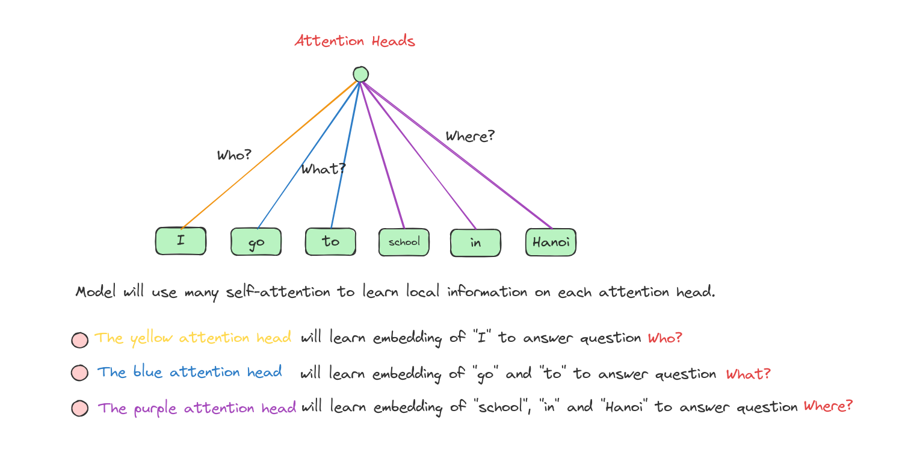
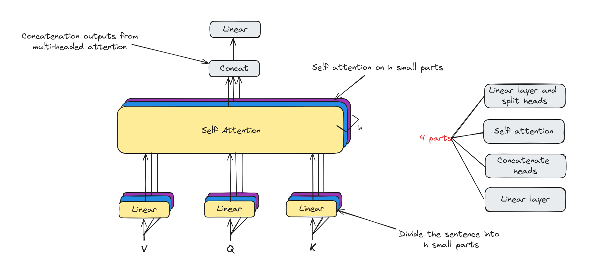
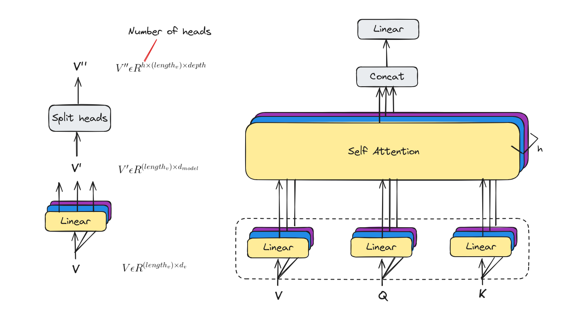
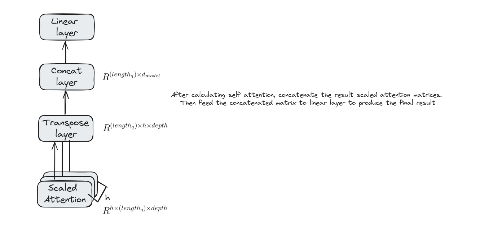

# Multi-Headed Attention

## Introduction

Multi-headed attention is a key component of modern neural networks, particularly in the Transformer architecture. It allows the model to focus on different parts of the input simultaneously, capturing a variety of relationships and patterns. Let's explore how this mechanism works.

## Self Attention Problem
Although using self attention brings us a lot of advantages, there are some problems that we may consider.

Let's talk a bit about **Convolution**.


Limitations of self attention:


Therefore, we need to use many attention heads to simulate the abilities of using convolutions.


## Multi-Headed Attention
Many attention heads expands the model’s ability to focus on different positions.


From original word embeddings, we divide them into 3 parts in case we use 3 attention heads.


**Note:** The number of heads must be a divisor of embedding's length

### Multi-Headed attention architecture 
Multi-Headed attention has the core component is self attention. Besides, it has some linear layers to map to desiable dimentions.


Now, we will deep dive into each components.

#### Linear layers and split into heads
With multi-headed attention we have not only one, but multiple sets of Query/Key/Value weight matrices. Each of these sets is randomly initialized.



#### Self attention
Calculate attention using the resulting Query/Key/Value matrices on each head.


#### Concat and Final Linear Layer


## Implementing Multi-Headed Attention
We will use the same datasets in the Attention lesson and then compare the result to measure how much Multi-Headed Attention mechanism improves our model. 

### Importing necessary libraries
This implementation was conducted on Google Colab.

```python
import os
import re
import seaborn as sns
from tqdm import tqdm
import pandas as pd
import numpy as np
import tensorflow as tf
print('tensorflow version:',tf.__version__)
import keras.backend as K
from keras.layers import Layer
import matplotlib.pylab as plt
from tensorflow.keras.preprocessing.text import Tokenizer 
from tensorflow.keras.preprocessing.sequence import pad_sequences
from tensorflow.keras.layers import LSTM, InputLayer, Dense, Embedding, Input, MultiHeadAttention, Flatten
from tensorflow.keras import Model
from sklearn.model_selection import train_test_split
```

### Loading datasets
```python
!wget https://raw.githubusercontent.com/dunghoang369/data/main/imdb_labelled.txt
!wget https://raw.githubusercontent.com/dunghoang369/data/main/amazon_cells_labelled.txt
!wget https://raw.githubusercontent.com/dunghoang369/data/main/yelp_labelled.txt

# Load datasets
imdb = pd.read_csv('amazon_cells_labelled.txt', sep="	", )
imdb.columns = ['text','label']
amazon = pd.read_csv('imdb_labelled.txt', sep="	", header = None)
amazon.columns = ['text','label']
yelp = pd.read_csv('yelp_labelled.txt', sep="	", header = None)
yelp.columns = ['text','label']

# Concatenation 
data = pd.concat([imdb,amazon,yelp])
```

### Preprocessing datasets
```python
# Cleaning text
def clean_text(dataset):
    for i in range(dataset.shape[0]):
        sentence=dataset.iloc[i,0]
        sentence=re.sub('[^A-Za-z0-9]+', ' ', str(sentence).lower()).strip()
        dataset.iloc[i,0]=sentence
    return data

corpus = clean_text(data)

# Build tokenizer
tokenizer = Tokenizer(num_words=1000,filters='!"#$%&()*+,-./:;<=>?@[\\]^_`{|}~\t\n')
tokenizer.fit_on_texts(corpus['text'])

# Convert text to number sequences
text_matrix = tokenizer.texts_to_sequences(corpus['text'])
text_pad = pad_sequences(text_matrix, maxlen=32, padding='post') 
```

### Creating data to train the model
```python
x_train = np.array(text_pad)
y_train = np.array(corpus['label'])
```

### Building an small attention model
```python
vocab_length = 3000
# model with attention mechanism
inputs = Input(shape=(text_pad.shape[1],))
x = Embedding(input_dim=vocab_length+1, output_dim=32,\
             input_length=text_pad.shape[1], embeddings_regularizer=tf.keras.regularizers.l2(.001))(inputs)
x1 = tf.keras.layers.Conv1D(
    filters=100,
    kernel_size=4,
    # Use 'same' padding so outputs have the same shape as inputs.
    padding='same')(x)
multi_headed_atten_layer = MultiHeadAttention(num_heads=4, key_dim=128)(query=x1, value=x1, key=x1)
flatten = Flatten()(atte_layer)
outputs = Dense(1, activation='sigmoid', trainable=True)(flatten)
model = Model(inputs,outputs)
model.summary()

Model: "model"
__________________________________________________________________________________________________
 Layer (type)                Output Shape                 Param #   Connected to                  
==================================================================================================
 input_10 (InputLayer)       [(None, 32)]                 0         []                            
                                                                                                  
 embedding_9 (Embedding)     (None, 32, 32)               96032     ['input_10[0][0]']            
                                                                                                  
 conv1d_9 (Conv1D)           (None, 32, 100)              12900     ['embedding_9[0][0]']         
                                                                                                  
 multi_head_attention_7 (Mu  (None, 32, 100)              206436    ['conv1d_9[0][0]',            
 ltiHeadAttention)                                                   'conv1d_9[0][0]',            
                                                                     'conv1d_9[0][0]']            
                                                                                                  
 flatten (Flatten)           (None, 3200)                 0         ['multi_head_attention_7[0][0]
                                                                    ']                            
                                                                                                  
 dense (Dense)               (None, 1)                    3201      ['flatten[0][0]']             
                                                                                                  
==================================================================================================
Total params: 318569 (1.22 MB)
Trainable params: 318569 (1.22 MB)
Non-trainable params: 0 (0.00 Byte)
__________________________________________________________________________________________________
```

### Training the attention model
```python
model.compile(loss='binary_crossentropy', optimizer='adam', metrics=['accuracy']  )
history = model.fit(x_train,y_train,epochs=10, validation_split=0.2,verbose=1,batch_size=64,shuffle=True).history
```

### Visualize training model's history
```python
plt.figure()
plt.ylabel("Loss (training and validation)")
plt.xlabel("Training Steps")
plt.ylim([0,2])
plt.plot(history1["loss"])
plt.plot(history1["val_loss"])

plt.figure()
plt.ylabel("Accuracy (training and validation)")
plt.xlabel("Training Steps")
plt.ylim([0,1])
plt.plot(history1["accuracy"])
plt.plot(history1["val_accuracy"])
```


### Inference
```python
def inference(text):
    text = []
    text_matrix = tokenizer.texts_to_sequences(sentence)
    text_pad = pad_sequences(text_matrix, maxlen=32, padding='post')
    result = model.predict(text_pad)
    if result[0][0] > 0.5:
        return "Positive"
    else:
        return "Negative"

print(inference("Saw the movie today and thought it was a good effort, good messages for kids."))
----> Positive
```

### Comparision
Multi-Headed Attention makes our model become better on training process, make model fit well on training data. Besides, it also increasingly overfits on the model so we have to be careful when use Multi-Headed Attention mechanism.

## Conclusion

In summary, the lesson on multi-headed attention demonstrated how this powerful mechanism allows neural networks to focus on multiple parts of the input simultaneously. 

By capturing diverse patterns and relationships, multi-headed attention significantly enhances tasks like language translation and text generation.


## References

+ J. Alammar, “The Illustrated Transformer,” jalammar.github.io, Jun. 27, 2018. https://jalammar.github.io/illustrated-transformer/


